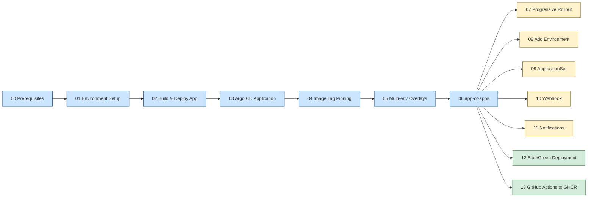
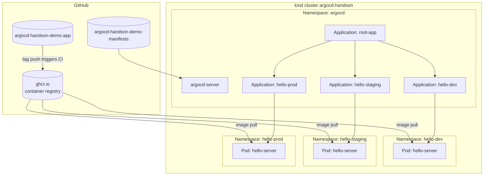

# argocd-handson-demo

**Argo CD + Kustomize + Spring Boot** による GitOps ハンズオンの完全再現ドキュメント集。

ローカル kind クラスタ上で、ミニマムな Spring Boot アプリ (Java 25) を題材に、kubectl の手動デプロイから始めて **Argo CD による自動 sync → コミット駆動更新 → マルチ環境化 → app-of-apps → Blue/Green デプロイ** までを段階的に実装します。

## このハンズオンで身につくこと

- Argo CD の `Application` リソースによる宣言的デプロイ
- Kustomize の `images:` ディレクティブによるイメージタグ管理
- `base/` + `overlays/` パターンによるマルチ環境化
- app-of-apps による「Application 自体の GitOps 化」
- Argo Rollouts による Blue/Green デプロイの基本

## 全体ロードマップ

## 想定読者

- Kubernetes の基礎知識 (Pod / Deployment / Service / Namespace の概念) がある
- Argo CD は未経験 or 触りはじめ
- Java / Spring Boot は雰囲気で読める (極小コードのみ)
- Linux / WSL2 + Docker が既にローカルにある

## 想定所要時間

| 範囲 | 時間 |
|------|------|
| 環境構築 (00 + 01) | 30〜60 分 |
| 中核 5 章 (02〜06) | 2〜3 時間 |
| 発展課題 5 章 (07〜11) | 各 30〜60 分、必要なものだけ |
| シナリオ (12 Blue/Green、13 GHCR CI/CD) | 各 1 時間 |

**ゼロから 06 まで通しで実施: 約 4〜5 時間**。

## 完成形のアーキテクチャ

## 章一覧

### 中核 (順番通りに実施推奨)
1. [00 - Prerequisites (前提環境)](docs/00-prerequisites.md)
2. [01 - Environment Setup (kind + Argo CD)](docs/01-environment-setup.md)
3. [02 - Build & Deploy App (Spring Boot + kubectl)](docs/02-build-and-deploy-app.md)
4. [03 - Argo CD Application (初回自動デプロイ)](docs/03-argocd-application.md)
5. [04 - Image Tag Pinning (Kustomize images directive)](docs/04-image-tag-pinning.md)
6. [05 - Multi-environment Overlays (dev/staging/prod)](docs/05-multi-environment-overlays.md)
7. [06 - app-of-apps (root-app による一括管理)](docs/06-app-of-apps.md)

### 発展課題 (任意、独立して実施可能)
8. [07 - Progressive Rollout (環境別バージョン管理)](docs/07-progressive-rollout.md)
9. [08 - Add Environment (4 つ目の env を 1 push で追加)](docs/08-add-environment.md)
10. [09 - ApplicationSet (List Generator で集約)](docs/09-applicationset.md)
11. [10 - Webhook Integration (GitHub → 即時 sync)](docs/10-webhook-integration.md)
12. [11 - Notifications (Slack 連携)](docs/11-notifications.md)

### シナリオ
13. [12 - Blue/Green Deployment (Argo Rollouts)](docs/12-blue-green-deployment.md)
14. [13 - GitHub Actions to GHCR (CI/CD パイプライン)](docs/13-github-actions-ghcr.md)

## リポジトリ構成

このハンズオンでは 3 つの GitHub リポジトリを使います:

| リポジトリ | 役割 | 中身 |
|-----------|------|------|
| `argocd-handson-demo` (このリポジトリ) | ドキュメントハブ | `docs/` 配下に章別マークダウン |
| `argocd-handson-demo-app` | デモアプリのソース | Spring Boot + Dockerfile |
| `argocd-handson-demo-manifests` | Kubernetes マニフェスト | base/ overlays/ applications/ |

`-app` と `-manifests` は GitOps の慣習に従い **アプリと運用設定を分離**。Argo CD は `-manifests` を Single Source of Truth として監視します。

## 始め方

[00 - Prerequisites](docs/00-prerequisites.md) から順に進めてください。各章は独立した冪等性 (= 何度実行しても同じ結果) を持つので、途中で詰まっても章単位でやり直せます。
