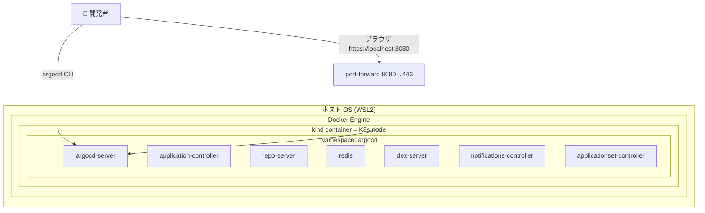

# 01 - Environment Setup (kind + Argo CD)

## 学習目標

- ローカルに **kind** で Kubernetes クラスタを 1 つ立てる
- そのクラスタに **Argo CD 本体をインストール** する
- ブラウザと CLI の両方から Argo CD に接続できる状態にする

## 前提

- [00 Prerequisites](00-prerequisites.md) のツール導入が完了している

## アーキテクチャ



Argo CD は **7 つのコンポーネント Pod** で構成され、すべて `argocd` namespace に入ります。

## 冪等性 (再実行する場合のリセット)

すでに `argocd-handson` クラスタがある場合、まず削除してクリーンスタート:

```bash
kind delete cluster --name argocd-handson 2>/dev/null || true
```

---

## Step 1-① kind クラスタ作成

```bash
kind create cluster --name argocd-handson
```

**期待される出力 (主要部分)**:
```
Creating cluster "argocd-handson" ...
 ✓ Ensuring node image (kindest/node:v1.31.x)
 ✓ Preparing nodes
 ✓ Writing configuration
 ✓ Starting control-plane
 ✓ Installing CNI
 ✓ Installing StorageClass
Set kubectl context to "kind-argocd-handson"
```

初回はノードイメージのダウンロード (約 500MB) で 1〜3 分かかります。

確認:
```bash
kubectl get nodes
```

**期待**: control-plane ノードが `Ready` (60 秒以内)。

---

## Step 1-② Argo CD 用 namespace 作成

```bash
kubectl create namespace argocd
```

**期待される出力**:
```
namespace/argocd created
```

---

## Step 1-③ Argo CD 本体インストール

公式の安定版マニフェストを apply。**`--server-side --force-conflicts` を必ず付ける** こと (理由は落とし穴セクション参照):

```bash
kubectl apply -n argocd \
  -f https://raw.githubusercontent.com/argoproj/argo-cd/stable/manifests/install.yaml \
  --server-side --force-conflicts
```

**期待される出力**: 大量の `... serverside-applied` が並び、最後までエラーなく完了 (50 行以上の出力)。

---

## Step 1-④ 全 Pod が Running になるまで待つ

```bash
kubectl get pods -n argocd -w
```

**期待される最終状態** (全 7 Pod が `1/1 Running`、3〜5 分かかる):

```
NAME                                                READY   STATUS    RESTARTS   AGE
argocd-application-controller-0                     1/1     Running   0          3m
argocd-applicationset-controller-xxx                1/1     Running   0          3m
argocd-dex-server-xxx                               1/1     Running   0          3m
argocd-notifications-controller-xxx                 1/1     Running   0          3m
argocd-redis-xxx                                    1/1     Running   0          3m
argocd-repo-server-xxx                              1/1     Running   0          3m
argocd-server-xxx                                   1/1     Running   0          3m
```

`Ctrl+C` で watch 終了。

---

## Step 1-⑤ port-forward (別ターミナルで起動しっぱなし)

**【新しいターミナル A】** を開いて以下を実行 (このターミナルは閉じない):

```bash
kubectl port-forward svc/argocd-server -n argocd 8080:443
```

**期待される出力**:
```
Forwarding from 127.0.0.1:8080 -> 8080
Forwarding from [::1]:8080 -> 8080
```

このプロセスがハンズオン全体を通じて動いている必要があります。

---

## Step 1-⑥ 初期 admin パスワード取得

```bash
argocd admin initial-password -n argocd
```

**期待される出力**:
```
<ランダム英数字 16 文字>

 This password must be only used for first time login. We strongly recommend you update the password using `argocd account update-password`.
```

このパスワードを **メモしておく** (以降の `argocd login` で使う)。

---

## Step 1-⑦ argocd CLI でログイン

```bash
argocd login localhost:8080 \
  --username admin \
  --password <上記のパスワード> \
  --insecure
```

`--insecure` は kind 上の Argo CD が自己署名証明書を使うため必要 (本番環境では不要)。

**期待される出力**:
```
'admin:login' logged in successfully
Context 'localhost:8080' updated
```

---

## Step 1-⑧ 動作確認

```bash
argocd version
argocd cluster list
```

**期待**:
- `argocd version` で Client/Server 両方のバージョンが出る
- `argocd cluster list` で `https://kubernetes.default.svc` が `in-cluster` として表示される (Status は `Unknown` で OK、Application が無いため)

---

## Step 1-⑨ ブラウザで UI アクセス

ブラウザで:
```
https://localhost:8080
```

自己署名証明書の警告が出たら **「詳細設定 → 安全でないが移動」** で進む。ログインフォームに:

- **Username**: `admin`
- **Password**: Step 1-⑥ で取得したパスワード

ログイン後、空の Applications 画面が表示されれば OK。

---

## 検証

```bash
# クラスタとコンテキスト
kubectl config current-context
# → kind-argocd-handson

# Argo CD コンポーネント
kubectl get pods -n argocd
# → 全 7 Pod が 1/1 Running

# CLI 接続
argocd version
# → Client + Server 両方のバージョンが出る
```

---

## 落とし穴 (トラブルシューティング)

### `metadata.annotations: Too long: must have at most 262144 bytes`

**原因**: Argo CD の `applicationsets.argoproj.io` CRD が大きすぎて、kubectl のクライアントサイド適用がアノテーションサイズ上限 (256KB) を超える。

**対処**: 必ず `--server-side` フラグを付ける。サーバーサイド適用はアノテーションに保存しないため上限影響なし。

### `Apply failed with N conflict: conflict with "kubectl-client-side-apply"`

**原因**: 過去にクライアントサイド適用した残骸がフィールドマネージャとして残っており、`--server-side` 適用と所有権が衝突。

**対処**: `--force-conflicts` も併用して所有権を強制移譲。

```bash
kubectl apply -n argocd -f <install.yaml URL> --server-side --force-conflicts
```

### Pod が `ContainerCreating` のまま動かない

**原因**: イメージ pull 中、もしくは node メモリ不足。

**対処**: `kubectl describe pod -n argocd <pod-name>` でイベント確認。pull 中ならただ待つ。OOM なら WSL2 のメモリ割り当てを確認 (`.wslconfig` で `memory=8GB` 等)。

### `argocd login` で connection refused

**原因**: port-forward が止まっている、もしくはまだ Argo CD server Pod が Ready でない。

**対処**: ターミナル A で port-forward が動いていること、`kubectl get pods -n argocd` で `argocd-server` が `1/1 Running` であることを確認。

---

## 一次情報

- [Argo CD Getting Started](https://argo-cd.readthedocs.io/en/stable/getting_started/) - 公式インストール手順
- [Argo CD Installation Manifest](https://raw.githubusercontent.com/argoproj/argo-cd/stable/manifests/install.yaml) - 適用される YAML 本体
- [Server-Side Apply (Kubernetes)](https://kubernetes.io/docs/reference/using-api/server-side-apply/) - `--server-side` の仕組み
- [kind Loading an Image](https://kind.sigs.k8s.io/docs/user/quick-start/#loading-an-image-into-your-cluster) - 後章で使う

---

[← 前へ 00 Prerequisites](00-prerequisites.md) | [次へ → 02 Build & Deploy App](02-build-and-deploy-app.md)
