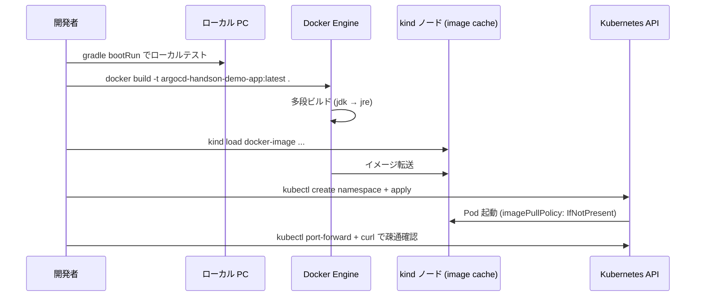

# 02 - Build & Deploy App

## 学習目標

- ミニマムな **Spring Boot 4 + Java 25 REST API** を作成する
- Docker イメージ化して **kind クラスタにロード** する
- **kubectl で手動デプロイ** して動作確認する (この時点ではまだ Argo CD は使わない)

## 前提

- [01 Environment Setup](01-environment-setup.md) が完了している
- kind クラスタ `argocd-handson` が稼働中
- Argo CD UI (https://localhost:8080) にアクセス可能 (port-forward 動作中)
- GitHub アカウントを持っている

## アーキテクチャ



## ファイル構成 (この章で扱う)

```
argocd-handson-demo-app/
├── .gitignore
├── .dockerignore
├── Dockerfile
├── settings.gradle.kts
├── build.gradle.kts
└── src/main/
    ├── java/com/example/demo/
    │   ├── DemoApplication.java
    │   └── HelloController.java
    └── resources/
        └── application.yml

argocd-handson-demo-manifests/
├── deployment.yaml
└── service.yaml
```

## ポート設計 (重要)

| 用途 | ポート | 理由 |
|------|-------|------|
| Argo CD UI (port-forward) | **8080** | 01 章で起動済み、変更不可 |
| Spring Boot アプリ | **8081** | Argo CD と衝突しないよう変更 |
| hello-server port-forward | **8081** | 上記に揃える |

---

## Step 2-① GitHub に 2 つのリポジトリを作成

ブラウザで <https://github.com/new> を開き、以下 2 つの **public リポジトリ** を作成:

1. `argocd-handson-demo-app` (アプリ用)
2. `argocd-handson-demo-manifests` (マニフェスト用)

**重要**: README / .gitignore / LICENSE は **チェックを入れない** (空リポジトリにする)。後でローカルから push する際に衝突しないため。

クローン:
```bash
cd ~/your-workspace-dir
git clone https://github.com/<USERNAME>/argocd-handson-demo-app.git
git clone https://github.com/<USERNAME>/argocd-handson-demo-manifests.git
```

---

## Step 2-② Spring Boot プロジェクト雛形作成

`argocd-handson-demo-app/` に以下のファイルを作成。

### `settings.gradle.kts`

```kotlin
rootProject.name = "argocd-handson-demo-app"
```

### `build.gradle.kts`

```kotlin
plugins {
    java
    id("org.springframework.boot") version "4.0.3"
    id("io.spring.dependency-management") version "1.1.7"
}

group = "com.example"
version = "0.0.1-SNAPSHOT"

java {
    toolchain {
        languageVersion = JavaLanguageVersion.of(25)
    }
}

repositories {
    mavenCentral()
}

dependencies {
    implementation("org.springframework.boot:spring-boot-starter-web")
    implementation("org.springframework.boot:spring-boot-starter-actuator")
}

tasks.withType<Test> {
    useJUnitPlatform()
}
```

### `src/main/java/com/example/demo/DemoApplication.java`

```java
package com.example.demo;

import org.springframework.boot.SpringApplication;
import org.springframework.boot.autoconfigure.SpringBootApplication;

@SpringBootApplication
public class DemoApplication {
    public static void main(String[] args) {
        SpringApplication.run(DemoApplication.class, args);
    }
}
```

### `src/main/java/com/example/demo/HelloController.java`

```java
package com.example.demo;

import org.springframework.beans.factory.annotation.Value;
import org.springframework.web.bind.annotation.GetMapping;
import org.springframework.web.bind.annotation.RestController;

@RestController
public class HelloController {

    private final String message;

    public HelloController(@Value("${app.message:default}") String message) {
        this.message = message;
    }

    @GetMapping("/")
    public String hello() {
        return "Hello, " + message + "!\n";
    }
}
```

### `src/main/resources/application.yml`

```yaml
server:
  port: 8081

app:
  message: ${MESSAGE:default}

management:
  endpoints:
    web:
      exposure:
        include: health
  endpoint:
    health:
      probes:
        enabled: true
```

設定ポイント:
- `server.port: 8081` で Argo CD と衝突回避
- `app.message: ${MESSAGE:default}` で **環境変数 `MESSAGE` を Spring の値に注入** (Kubernetes の env から渡る)
- `management.endpoint.health.probes.enabled: true` で **`/actuator/health/liveness` と `/actuator/health/readiness`** が有効化される (Kubernetes の liveness/readiness probe で使用)

### `Dockerfile`

```dockerfile
# syntax=docker/dockerfile:1.7

FROM eclipse-temurin:25-jdk-alpine AS builder
WORKDIR /workspace
COPY gradle gradle
COPY gradlew settings.gradle.kts build.gradle.kts ./
COPY src src
RUN chmod +x gradlew && ./gradlew bootJar --no-daemon

FROM eclipse-temurin:25-jre-alpine
WORKDIR /app
RUN addgroup -S app && adduser -S app -G app
USER app
COPY --from=builder --chown=app:app /workspace/build/libs/*.jar app.jar
EXPOSE 8081
ENTRYPOINT ["java", "-jar", "/app/app.jar"]
```

多段ビルドのポイント:
- **Builder ステージ**: `eclipse-temurin:25-jdk-alpine` で Gradle ビルド
- **Runtime ステージ**: `eclipse-temurin:25-jre-alpine` で JRE のみ (約 250MB に抑制)
- **非 root ユーザー** (`app`) で実行 (セキュリティ)

### `.dockerignore`

```
.git
.gitignore
.gitattributes
build
.gradle
*.md
LICENSE
.idea
.vscode
*.iml
```

### `.gitignore`

```
### Gradle ###
.gradle
build/
!gradle/wrapper/gradle-wrapper.jar

### IDEA ###
.idea/
*.iws
*.iml
*.ipr

### VS Code ###
.vscode/

### macOS ###
.DS_Store
```

---

## Step 2-③ Gradle Wrapper 生成

```bash
cd argocd-handson-demo-app
gradle wrapper --gradle-version 9.4.0
./gradlew --version
```

**期待される出力**:
```
Gradle 9.4.0
Launcher JVM:  25.0.x
```

これで `gradlew` `gradlew.bat` `gradle/wrapper/` が生成され、以後 `./gradlew` で固定バージョンの Gradle を使えます。

---

## Step 2-④ ローカル動作確認

```bash
MESSAGE="Local Test" ./gradlew bootRun
```

**期待される起動ログ**:
```
:: Spring Boot ::                (v4.0.3)
... Tomcat initialized with port 8081 (http) ...
... Started DemoApplication in X.XXX seconds ...
```

**【別ターミナル】**:
```bash
curl http://localhost:8081/
curl http://localhost:8081/actuator/health
```

**期待出力**:
```
$ curl http://localhost:8081/
Hello, Local Test!

$ curl http://localhost:8081/actuator/health
{"groups":["liveness","readiness"],"status":"UP"}
```

`Hello, Local Test!` が返れば **環境変数 `MESSAGE` の注入も含めて完全動作**。確認できたら `bootRun` を `Ctrl+C` で停止。

---

## Step 2-⑤ Docker build → kind load

```bash
# Docker build (初回 3〜5 分、Spring 依存ダウンロード含む)
docker build -t argocd-handson-demo-app:latest .

# 確認
docker images | grep argocd-handson-demo-app

# kind ノードへロード (40〜60 秒)
kind load docker-image argocd-handson-demo-app:latest --name argocd-handson

# kind ノード内に存在することを確認
docker exec argocd-handson-control-plane crictl images | grep argocd-handson-demo-app
```

**期待**: 最後のコマンドで `docker.io/library/argocd-handson-demo-app   latest   ...` が表示される。

---

## Step 2-⑥ Kubernetes マニフェスト作成

`argocd-handson-demo-manifests/` に以下を作成。

### `deployment.yaml`

```yaml
apiVersion: apps/v1
kind: Deployment
metadata:
  name: hello-server
  labels:
    app: hello-server
spec:
  replicas: 1
  selector:
    matchLabels:
      app: hello-server
  template:
    metadata:
      labels:
        app: hello-server
    spec:
      containers:
        - name: hello-server
          image: argocd-handson-demo-app:latest
          imagePullPolicy: IfNotPresent
          ports:
            - name: http
              containerPort: 8081
          env:
            - name: MESSAGE
              value: "Step1"
          resources:
            requests:
              cpu: "100m"
              memory: "256Mi"
            limits:
              cpu: "500m"
              memory: "512Mi"
          livenessProbe:
            httpGet:
              path: /actuator/health/liveness
              port: 8081
            initialDelaySeconds: 30
            periodSeconds: 10
          readinessProbe:
            httpGet:
              path: /actuator/health/readiness
              port: 8081
            initialDelaySeconds: 10
            periodSeconds: 5
```

ポイント:
- **`imagePullPolicy: IfNotPresent`**: kind ノードにロード済みのイメージを使い、レジストリ pull はしない
- **`MESSAGE: "Step1"`**: ConfigMap 経由ではなく直接 env で注入 (Step5 でこの値が overlay 別に変わる)
- **liveness/readiness probe**: Spring Boot Actuator の専用パスを叩く

### `service.yaml`

```yaml
apiVersion: v1
kind: Service
metadata:
  name: hello-server
spec:
  type: ClusterIP
  selector:
    app: hello-server
  ports:
    - name: http
      port: 8081
      targetPort: 8081
```

---

## Step 2-⑦ kubectl で手動デプロイ

```bash
# namespace 作成
kubectl create namespace hello-server

# Deployment と Service を apply
kubectl apply -n hello-server -f ~/your-workspace/argocd-handson-demo-manifests/deployment.yaml
kubectl apply -n hello-server -f ~/your-workspace/argocd-handson-demo-manifests/service.yaml

# Pod が Running になるのを待つ
kubectl get pods -n hello-server -w
```

**期待**: `hello-server-xxxx` が `1/1 Running` になる (10〜30 秒)。`Ctrl+C` で抜ける。

---

## Step 2-⑧ port-forward + curl 疎通確認

**【別ターミナル】**:
```bash
kubectl port-forward -n hello-server svc/hello-server 8081:8081
```

**【メインターミナル】**:
```bash
curl http://localhost:8081/
```

**期待出力**:
```
Hello, Step1!
```

`Step1` という値は `deployment.yaml` の `env: MESSAGE: "Step1"` から来ている (ローカル時の "Local Test" から差し替わったことが Kubernetes 経由デプロイの証跡)。

---

## Step 2-⑨ クリーンアップ + git push

次の章で Argo CD が同じ `hello-server` namespace を管理するので、**手動デプロイしたリソースを一旦削除**:

```bash
# port-forward を Ctrl+C で停止

# namespace ごと削除 (Deployment / Service もまとめて消える)
kubectl delete namespace hello-server
```

両リポジトリを GitHub に push:

```bash
# app リポジトリ
cd ~/your-workspace/argocd-handson-demo-app
git add .
git commit -m "Add minimal Spring Boot 4.0.3 hello-server app"
git push origin main

# manifests リポジトリ
cd ~/your-workspace/argocd-handson-demo-manifests
git add .
git commit -m "Add deployment.yaml and service.yaml for hello-server"
git push origin main
```

---

## 検証

- ローカル `./gradlew bootRun` で `Hello, Local Test!` (MESSAGE env 注入確認)
- Docker build 成功 (`docker images` で `argocd-handson-demo-app:latest` あり)
- kind load 成功 (`crictl images` で kind ノード内に存在)
- kubectl デプロイ後、`Hello, Step1!` が curl で返る
- 両リポジトリの GitHub 上に push 反映

---

## 落とし穴 (トラブルシューティング)

| 症状 | 原因 | 対処 |
|------|------|------|
| `Port 8080 was already in use` | Argo CD UI が 8080 を使用中 | `application.yml` で `server.port: 8081` にする (本ハンズオン採用) |
| `kind load` が `cluster not found` | クラスタ名指定漏れ | `--name argocd-handson` を必ず指定 |
| Pod が `ImagePullBackOff` | kind ノードへの load 漏れ | `kind load docker-image ...` を再実行 |
| `OOMKilled` | メモリ不足 | `resources.limits.memory` を増やす、もしくは WSL2 の `.wslconfig` でメモリ拡張 |
| Spring Boot 起動 30 秒以上 | 初回 JIT/起動が遅い | `livenessProbe.initialDelaySeconds` を 60 に増やす |
| `git push` 認証エラー | Personal Access Token 未設定 | [GitHub PAT 公式](https://docs.github.com/en/authentication/keeping-your-account-and-data-secure/managing-your-personal-access-tokens) 参照 |

---

## 一次情報

- [Spring Boot Documentation](https://docs.spring.io/spring-boot/index.html) - Spring Boot 公式
- [Spring Boot Actuator](https://docs.spring.io/spring-boot/reference/actuator/endpoints.html) - Actuator エンドポイント
- [Spring Boot Kubernetes Probes](https://docs.spring.io/spring-boot/reference/actuator/endpoints.html#actuator.endpoints.kubernetes-probes) - liveness/readiness probe
- [Eclipse Temurin Docker Images](https://hub.docker.com/_/eclipse-temurin) - Java ベースイメージ
- [Dockerfile Reference](https://docs.docker.com/reference/dockerfile/) - 多段ビルド構文
- [kind: Loading an Image](https://kind.sigs.k8s.io/docs/user/quick-start/#loading-an-image-into-your-cluster) - レジストリなしでクラスタへ image を渡す方法

---

[← 前へ 01 Environment Setup](01-environment-setup.md) | [次へ → 03 Argo CD Application](03-argocd-application.md)
