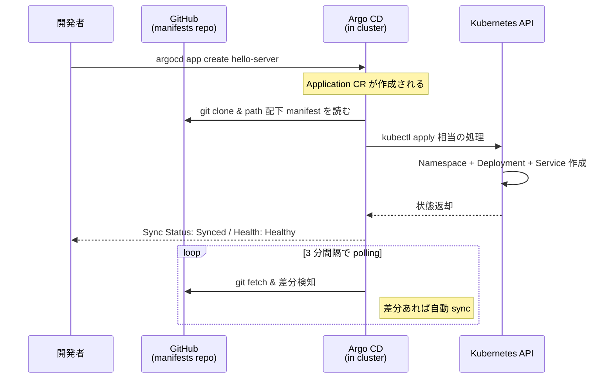

# 03 - Argo CD Application

## 学習目標

- 前章で kubectl 手動デプロイした内容を **Argo CD に肩代わりさせる**
- `Application` リソースの基本フィールドを理解する
- **git の状態 ↔ クラスタの実体を継続的に同期する** GitOps の核を体験する

## 前提

- [02 Build & Deploy App](02-build-and-deploy-app.md) が完了している
- `argocd-handson-demo-manifests` リポジトリが GitHub に push されている
- `hello-server` namespace は削除済み (Argo CD が再作成する)

## アーキテクチャ



**Application** = Argo CD の最小管理単位。「**どの repo の何を、どの cluster の何処に展開するか**」を 1 つの YAML で宣言する。

## 冪等性 (再実行する場合のリセット)

```bash
argocd app delete hello-server --cascade -y 2>/dev/null || true
kubectl delete namespace hello-server 2>/dev/null || true
```

---

## Step 3-① 前章の状態を確認

manifests リポジトリの URL を取得:

```bash
cd ~/your-workspace/argocd-handson-demo-manifests
git remote -v
```

**期待出力**:
```
origin  https://github.com/<USERNAME>/argocd-handson-demo-manifests.git (fetch)
origin  https://github.com/<USERNAME>/argocd-handson-demo-manifests.git (push)
```

この URL を以下のコマンドで `<URL>` プレースホルダに置換します。

---

## Step 3-② Argo CD Application を作成

```bash
argocd app create hello-server \
  --repo <URL> \
  --path . \
  --dest-server https://kubernetes.default.svc \
  --dest-namespace hello-server \
  --sync-policy auto \
  --sync-option CreateNamespace=true
```

**期待される出力**:
```
application 'hello-server' created
```

### 各オプションの意味

| オプション | 意味 |
|----------|------|
| `--repo` | Argo CD が監視する Git リポジトリ URL |
| `--path .` | リポジトリのどのディレクトリか (ルート) |
| `--dest-server` | デプロイ先クラスタ。`kubernetes.default.svc` は Argo CD 自身が動いているクラスタを指す内部 DNS |
| `--dest-namespace` | デプロイ先 namespace |
| `--sync-policy auto` | git に push されたら自動 sync (= Argo CD が起動した時 / git が変わった時に勝手に同期する) |
| `--sync-option CreateNamespace=true` | namespace が無ければ Argo CD が作る (前章で削除した namespace が自動再作成される) |

---

## Step 3-③ 状態確認

```bash
argocd app get hello-server
```

**期待される出力 (主要部分)**:
```
Name:               argocd/hello-server
Project:            default
Server:             https://kubernetes.default.svc
Namespace:          hello-server
Source:
- Repo:             https://github.com/<USERNAME>/argocd-handson-demo-manifests.git
  Path:             .
Sync Policy:        Automated
Sync Status:        Synced to  (xxxxxxx)
Health Status:      Healthy

GROUP  KIND        NAMESPACE     NAME          STATUS  HEALTH   HOOK  MESSAGE
       Namespace                 hello-server  Synced                 namespace/hello-server created
       Service     hello-server  hello-server  Synced  Healthy        service/hello-server created
apps   Deployment  hello-server  hello-server  Synced  Healthy        deployment.apps/hello-server created
```

ポイント:
- **`Sync Status: Synced`**: git の状態 ↔ クラスタの状態が一致
- **`Health Status: Healthy`**: Pod が Ready で稼働中
- 配下リソース (Namespace / Service / Deployment) が個別に表示される

最初は `Sync Status: OutOfSync` → `Progressing` → `Synced` と遷移します。`Healthy` になるまで 30〜60 秒。

---

## Step 3-④ ブラウザで Argo CD UI を開く

URL: <https://localhost:8080>

ログイン後、`hello-server` カードをクリックすると **リソースグラフ** が表示されます:

```
hello-server (App) → SVC + Deploy → ReplicaSet → Pod
```

各ノードをクリックすると詳細 (yaml/events/logs) が見られます。

**ここで掴んでほしいメンタルモデル**:
> Argo CD は「git の宣言 ↔ クラスタの実体」を **継続的に比較して、ズレたら埋め合わせる** ループを回しているだけ。kubectl apply の自動化ではなく、状態同期エンジン。

---

## Step 3-⑤ port-forward + curl で疎通確認

**【別ターミナル C】**:
```bash
kubectl port-forward -n hello-server svc/hello-server 8081:8081
```

**【メインターミナル】**:
```bash
curl http://localhost:8081/
```

**期待出力**:
```
Hello, Step1!
```

前章で kubectl 手動デプロイした時と **同じレスポンス** が返る = Argo CD 経由でも結果は同じ。違いは「誰が apply しているか」(自分 → Argo CD)。

---

## Step 3-⑥ GitOps loop の体験 (任意)

manifests を直接 push して Argo CD が反応することを確認します。

```bash
cd ~/your-workspace/argocd-handson-demo-manifests

# deployment.yaml の MESSAGE 値を変更 (例: "Step1" → "Step1 - via Argo CD")
# エディタで編集後:
git diff
git add deployment.yaml
git commit -m "Test GitOps: change MESSAGE"
git push origin main
```

直後に Argo CD UI を見ると `Sync Status` が一時的に `OutOfSync` → 自動 sync → `Synced` に戻り、Pod が再作成される様子が見えます (auto-sync の効果)。

```bash
curl http://localhost:8081/
# → "Hello, Step1 - via Argo CD!"
```

確認後、元の `Step1` に戻して push しておく:
```bash
# 編集して Step1 に戻す
git add deployment.yaml
git commit -m "Revert MESSAGE to Step1"
git push origin main
```

---

## 検証

- `argocd app list` に `hello-server` が `Synced / Healthy` で表示
- `kubectl get pods -n hello-server` で `1/1 Running`
- `curl http://localhost:8081/` で `Hello, Step1!`
- Argo CD UI でリソースグラフが見える

---

## CLI vs Declarative

ここでは `argocd app create` (CLI) を使いましたが、**Application 自体を YAML マニフェストにして git 管理する方式 (Declarative)** が実務寄り。06 章 (app-of-apps) で declarative 化します。

### CLI 形式 (今回)
```bash
argocd app create hello-server --repo ... --path . ...
```

### Declarative 形式 (06 章で扱う)
```yaml
apiVersion: argoproj.io/v1alpha1
kind: Application
metadata:
  name: hello-server
  namespace: argocd
spec:
  source:
    repoURL: https://github.com/...
    path: .
  destination:
    namespace: hello-server
    server: https://kubernetes.default.svc
  syncPolicy:
    automated: {}
```

両者は機能的に等価。Declarative は Application も GitOps 化できる利点がある (= 設定変更が git 履歴に残る)。

---

## 落とし穴 (トラブルシューティング)

| 症状 | 原因 | 対処 |
|------|------|------|
| `Sync Status: OutOfSync` のまま固まる | Argo CD 側の同期失敗 | `argocd app sync hello-server` で手動 sync |
| `Health Status: Degraded` | Pod 起動失敗 | `kubectl describe pod -n hello-server` でイベント確認、ImagePullBackOff なら kind load 漏れ |
| `Unknown comparison status` | repo にアクセスできない | リポジトリが public か確認、private なら `argocd repo add` で認証情報追加 |
| `connection refused` (port-forward) | Pod が Ready でない | `kubectl get pods -n hello-server` で `READY 1/1` 確認、まだなら待つ |
| UI のグラフが反映されない | Auto-refresh OFF | UI 右上の Auto-refresh トグルを ON、もしくは手動 Refresh |

---

## 一次情報

- [Argo CD - Getting Started](https://argo-cd.readthedocs.io/en/stable/getting_started/) - 公式入門
- [Argo CD - Declarative Setup](https://argo-cd.readthedocs.io/en/stable/operator-manual/declarative-setup/) - Application マニフェスト構造
- [Argo CD - Sync Options](https://argo-cd.readthedocs.io/en/stable/user-guide/sync-options/) - syncPolicy / syncOptions の詳細
- [Argo CD - Auto Sync](https://argo-cd.readthedocs.io/en/stable/user-guide/auto_sync/) - 自動同期の挙動

---

[← 前へ 02 Build & Deploy App](02-build-and-deploy-app.md) | [次へ → 04 Image Tag Pinning](04-image-tag-pinning.md)
