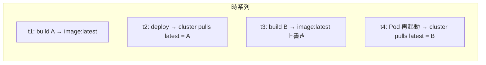
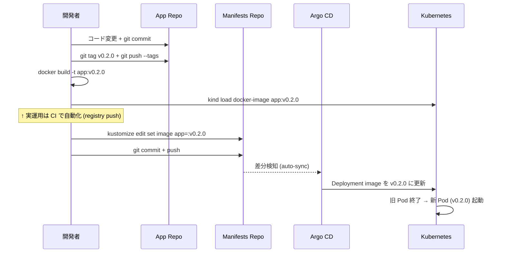

# 04 - Image Tag Pinning

## 学習目標

- `:latest` タグの **再現性問題** を理解する
- **コミットハッシュ駆動** と **git tag 駆動** の 2 つのバージョン管理戦略を体験する
- Kustomize の **`images:` ディレクティブ** で manifest を書き換えずに image tag を上書きする

## 前提

- [03 Argo CD Application](03-argocd-application.md) が完了している
- `hello-server` Application が稼働中 (`Synced / Healthy`)

## 背景: なぜ `:latest` が問題か



- 同じ `:latest` という指定が **時刻によって違うイメージ** を指す
- どの commit が本番で動いているかを **後から追跡できない**
- ロールバック困難 (前のイメージは上書きされて消えている)

## 解決策の 2 アプローチ

| 戦略 | image tag 形式 | 利点 | 欠点 |
|------|--------------|------|------|
| コミットハッシュ駆動 | `:449898d` | 全 commit が deploy 可能、完全追跡 | tag 数が爆発、リリース境界が不明瞭 |
| **git tag 駆動 (推奨)** | `:v0.1.0` | リリース境界が semver で明示、tag 数が管理可能 | tag を切らない commit は deploy できない |

本章は **git tag 駆動** で進めます (実務 GitOps の主流)。

## アーキテクチャ



## 冪等性 (再実行する場合のリセット)

```bash
# manifests repo のローカルクローンで kustomization.yaml を消し、再作成する
cd ~/your-workspace/argocd-handson-demo-manifests
rm -f kustomization.yaml
git checkout deployment.yaml service.yaml 2>/dev/null || true
```

---

## Step 4-① Kustomize 化 (見た目の挙動を変えずに準備)

`argocd-handson-demo-manifests/kustomization.yaml` を新規作成:

```yaml
apiVersion: kustomize.config.k8s.io/v1beta1
kind: Kustomization

resources:
  - deployment.yaml
  - service.yaml

images:
  - name: argocd-handson-demo-app
    newTag: latest
```

ポイント:
- `resources:` で従来の YAML を列挙 (Kustomize がこれらを束ねる)
- `images:` ディレクティブで「`argocd-handson-demo-app` という image 名を見つけたら tag を `latest` に書き換える」と宣言
- 現時点では `latest` のままなので **挙動は変わらない**

検証:
```bash
cd ~/your-workspace/argocd-handson-demo-manifests
kubectl kustomize .
```

deployment.yaml と service.yaml の内容がそのまま (image=`:latest`) で出力されれば OK。

---

## Step 4-② commit + push (Kustomize 化のみ)

```bash
git add kustomization.yaml
git commit -m "Add kustomization.yaml to enable image tag override"
git push origin main
```

Argo CD UI を見ると `Sync Status` が `OutOfSync` → `Synced` と一瞬遷移し、**Kustomize ベース管理に切り替わる**。Argo CD は `kustomization.yaml` の存在を自動検知して、kustomize render の結果を deploy します ([Argo CD Kustomize 公式](https://argo-cd.readthedocs.io/en/stable/user-guide/kustomize/))。

```bash
argocd app get hello-server | head -10
# Sync Status: Synced / Health: Healthy のままなら OK
```

---

## Step 4-③ アプリを変更してリリース v0.1.0 を切る

`HelloController.java` を編集して目に見える変化を加える:

```java
@GetMapping("/")
public String hello() {
    return "Hello, " + message + "! [v2]\n";  // 末尾に [v2] を追加
}
```

```bash
cd ~/your-workspace/argocd-handson-demo-app

# commit
git add src/main/java/com/example/demo/HelloController.java
git commit -m "Update HelloController to add [v2] suffix"
git push origin main

# git tag v0.1.0 を切る (annotated tag 推奨)
git tag -a v0.1.0 -m "First release with [v2] suffix"
git push origin v0.1.0

# 確認
git tag --list
```

**期待**: `git tag --list` で `v0.1.0` が表示される。GitHub の Releases / Tags タブにも反映される。

---

## Step 4-④ image を v0.1.0 として build & kind load

```bash
# build (キャッシュが効くので 30 秒程度)
docker build -t argocd-handson-demo-app:v0.1.0 .

# kind ノードへロード
kind load docker-image argocd-handson-demo-app:v0.1.0 --name argocd-handson

# 確認
docker exec argocd-handson-control-plane crictl images | grep argocd-handson-demo-app
```

**期待**: `argocd-handson-demo-app:latest` (前章) と `:v0.1.0` (今回) の **両方** が kind ノードに存在。

---

## Step 4-⑤ kustomization.yaml の newTag を v0.1.0 に更新

2 つの方法があります:

### 方法 A: kustomize CLI を使う

```bash
cd ~/your-workspace/argocd-handson-demo-manifests
kubectl kustomize . | grep image:  # 変更前確認
# image: argocd-handson-demo-app:latest

# kustomize edit set image (kubectl kustomize は edit サブコマンドを持たないので kustomize CLI 別途必要)
# シンプルに sed で書き換えるか、エディタで直接編集
```

### 方法 B: 直接エディタで編集 (シンプル)

`kustomization.yaml` の `newTag: latest` を `newTag: v0.1.0` に書き換え:

```yaml
images:
  - name: argocd-handson-demo-app
    newTag: v0.1.0
```

検証:
```bash
kubectl kustomize . | grep image:
# image: argocd-handson-demo-app:v0.1.0
```

---

## Step 4-⑥ commit + push して Argo CD に sync させる

```bash
git add kustomization.yaml
git commit -m "Pin image to v0.1.0"
git push origin main
```

Argo CD UI を見ると:
1. `Sync Status` が `OutOfSync` に
2. 自動 sync が走り、Deployment の image が更新される
3. 旧 Pod (`:latest`) が Terminating、新 Pod (`:v0.1.0`) が Running
4. `Sync Status: Synced` / `Health: Healthy` に戻る

CLI で確認:
```bash
argocd app get hello-server
# Sync Status: Synced to main (xxxxxxx)

kubectl get pods -n hello-server
kubectl describe pod -n hello-server -l app=hello-server | grep "Image:"
# Image:          argocd-handson-demo-app:v0.1.0
```

---

## Step 4-⑦ 動作確認 (新しい [v2] レスポンス)

port-forward が切れていたら再起動 (Pod 入れ替えで切れる):

```bash
kubectl port-forward -n hello-server svc/hello-server 8081:8081
```

別ターミナルで:
```bash
curl http://localhost:8081/
```

**期待出力**:
```
Hello, Step1! [v2]
```

**`[v2]` が末尾に付けば**、git tag 駆動の更新が完全に成立した証拠です。

---

## 検証

- App リポジトリに `v0.1.0` tag が存在 (`git tag --list`)
- kind ノードに `:v0.1.0` イメージが存在
- `kustomization.yaml` の `newTag: v0.1.0`
- Argo CD UI: `Sync Status: Synced`, `Health: Healthy`
- Pod の Image が `argocd-handson-demo-app:v0.1.0`
- curl レスポンスに `[v2]` 含む

---

## 反復ループの自動化アイデア (運用補助スクリプト例)

毎回手動でやると面倒なので、以下のようなシェルスクリプトを `~/bin/release.sh` として持つと便利:

```bash
#!/usr/bin/env bash
set -euo pipefail
TAG=${1:?"Usage: release.sh <tag>"}
APP_DIR=~/your-workspace/argocd-handson-demo-app
MANIFESTS_DIR=~/your-workspace/argocd-handson-demo-manifests
CLUSTER=argocd-handson

cd "$APP_DIR"
git tag -a "$TAG" -m "Release $TAG"
git push origin "$TAG"
docker build -t "argocd-handson-demo-app:$TAG" .
kind load docker-image "argocd-handson-demo-app:$TAG" --name "$CLUSTER"

cd "$MANIFESTS_DIR"
sed -i "s/^    newTag: .*/    newTag: $TAG/" kustomization.yaml
git add kustomization.yaml
git commit -m "Pin image to $TAG"
git push origin main
```

実運用では Container Registry (ghcr.io 等) に push して `kind load` 不要にし、CI でこの一連を自動化します。

---

## 落とし穴 (トラブルシューティング)

| 症状 | 原因 | 対処 |
|------|------|------|
| `kubectl kustomize .` が空 | `kustomization.yaml` の YAML 構文エラー | スペース/インデント確認、minimum 構造に戻して再構築 |
| Pod が `ErrImagePull` | kind load 漏れ | `kind load docker-image argocd-handson-demo-app:<TAG> --name argocd-handson` 再実行 |
| `Sync` 後も `Image:` が古い tag | Deployment の `image:` を上書きしていない | `kubectl kustomize .` で render 結果の `image:` を確認、`images.name:` が正しいか (deployment.yaml の image 名と一致が必須) |
| port-forward `lost connection` | Pod 入れ替え時に発生する正常現象 | 一度切って再起動 |

---

## 一次情報

- [Argo CD - Kustomize](https://argo-cd.readthedocs.io/en/stable/user-guide/kustomize/) - Argo CD の Kustomize サポート
- [Kustomize images transformer](https://kubectl.docs.kubernetes.io/references/kustomize/builtins/#_imagetagtransformer_) - `images:` ディレクティブの仕様
- [Kustomize Reference](https://kubectl.docs.kubernetes.io/references/kustomize/) - 全フィールドリファレンス

---

[← 前へ 03 Argo CD Application](03-argocd-application.md) | [次へ → 05 Multi-environment Overlays](05-multi-environment-overlays.md)
