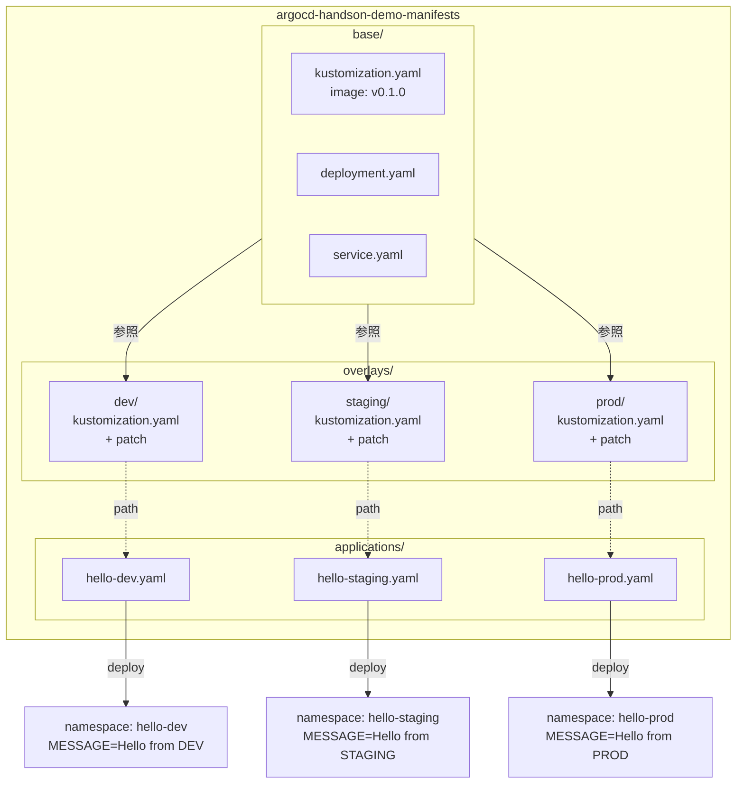

# 05 - Multi-environment Overlays

## 学習目標

- 1 つのアプリを **dev / staging / prod の 3 環境** で同時に稼働させる
- Kustomize の **`base/` + `overlays/` パターン** を実装する
- 環境ごとの差分 (namespace, env var) を **strategic merge patch** で表現する

## 前提

- [04 Image Tag Pinning](04-image-tag-pinning.md) が完了している
- `hello-server` Application が `:v0.1.0` で稼働中

## アーキテクチャ



各環境は **同じ image (`:v0.1.0`)** を **異なる namespace + 異なる MESSAGE** で動かします。

## 冪等性 (再実行する場合のリセット)

```bash
# 既存 Application 削除
for env in hello-server hello-dev hello-staging hello-prod; do
  argocd app delete $env --cascade -y 2>/dev/null || true
done

# 既存 manifests 構造を削除
cd ~/your-workspace/argocd-handson-demo-manifests
rm -rf base/ overlays/ applications/
# deployment.yaml / service.yaml / kustomization.yaml は前章のものをそのまま使う or リセット
```

---

## Step 5-① 既存 Application のクリーンアップ

前章の `hello-server` を削除して、3 つの新しい Application で置き換えるための準備:

```bash
argocd app delete hello-server --cascade -y
argocd app list  # 空になっていること

kubectl delete namespace hello-server
```

**注意**: `--cascade` で配下リソースも全部消えるので、port-forward は切れる。Ctrl+C で止めて OK。

---

## Step 5-② manifests リポジトリを base/overlays 構造に再編

既存ファイルを base/ に移動し、overlays/ と applications/ を新設:

```bash
cd ~/your-workspace/argocd-handson-demo-manifests

# 既存ファイルを削除 (base/ で再作成する)
rm deployment.yaml service.yaml kustomization.yaml

# 新ディレクトリ作成
mkdir -p base overlays/{dev,staging,prod} applications
```

---

## Step 5-③ base/ ディレクトリ作成

### `base/kustomization.yaml`

```yaml
apiVersion: kustomize.config.k8s.io/v1beta1
kind: Kustomization

resources:
  - deployment.yaml
  - service.yaml

images:
  - name: argocd-handson-demo-app
    newTag: v0.1.0
```

### `base/deployment.yaml`

```yaml
apiVersion: apps/v1
kind: Deployment
metadata:
  name: hello-server
  labels:
    app: hello-server
spec:
  replicas: 1
  selector:
    matchLabels:
      app: hello-server
  template:
    metadata:
      labels:
        app: hello-server
    spec:
      containers:
        - name: hello-server
          image: argocd-handson-demo-app:latest
          imagePullPolicy: IfNotPresent
          ports:
            - name: http
              containerPort: 8081
          env:
            - name: MESSAGE
              value: "default"
          resources:
            requests:
              cpu: "100m"
              memory: "256Mi"
            limits:
              cpu: "500m"
              memory: "512Mi"
          livenessProbe:
            httpGet:
              path: /actuator/health/liveness
              port: 8081
            initialDelaySeconds: 30
            periodSeconds: 10
          readinessProbe:
            httpGet:
              path: /actuator/health/readiness
              port: 8081
            initialDelaySeconds: 10
            periodSeconds: 5
```

ポイント:
- `MESSAGE: "default"` をプレースホルダとして残す (overlay が strategic merge patch で上書き)
- `image: argocd-handson-demo-app:latest` のままで OK (kustomization.yaml の `images:` で `:v0.1.0` に置換される)

### `base/service.yaml`

```yaml
apiVersion: v1
kind: Service
metadata:
  name: hello-server
spec:
  type: ClusterIP
  selector:
    app: hello-server
  ports:
    - name: http
      port: 8081
      targetPort: 8081
```

---

## Step 5-④ overlays/ 各環境ディレクトリ作成

3 環境とも構造は同じで、namespace と MESSAGE 値だけ異なります。

### `overlays/dev/kustomization.yaml`

```yaml
apiVersion: kustomize.config.k8s.io/v1beta1
kind: Kustomization

namespace: hello-dev

resources:
  - ../../base

patches:
  - path: deployment-patch.yaml
    target:
      kind: Deployment
      name: hello-server
```

### `overlays/dev/deployment-patch.yaml`

```yaml
apiVersion: apps/v1
kind: Deployment
metadata:
  name: hello-server
spec:
  template:
    spec:
      containers:
        - name: hello-server
          env:
            - name: MESSAGE
              value: "Hello from DEV"
```

ポイント:
- これは **strategic merge patch** ([Kustomize 公式](https://kubectl.docs.kubernetes.io/references/kustomize/builtins/#_patchtransformer_))。Deployment 全体を再記述するのではなく、変更したいフィールドだけを書く
- `containers[name="hello-server"].env` がマージされ、`MESSAGE` の値だけ上書きされる
- `namespace: hello-dev` は kustomization.yaml の宣言で、配下の全リソースに適用される

### `overlays/staging/kustomization.yaml`

```yaml
apiVersion: kustomize.config.k8s.io/v1beta1
kind: Kustomization

namespace: hello-staging

resources:
  - ../../base

patches:
  - path: deployment-patch.yaml
    target:
      kind: Deployment
      name: hello-server
```

### `overlays/staging/deployment-patch.yaml`

```yaml
apiVersion: apps/v1
kind: Deployment
metadata:
  name: hello-server
spec:
  template:
    spec:
      containers:
        - name: hello-server
          env:
            - name: MESSAGE
              value: "Hello from STAGING"
```

### `overlays/prod/kustomization.yaml`

```yaml
apiVersion: kustomize.config.k8s.io/v1beta1
kind: Kustomization

namespace: hello-prod

resources:
  - ../../base

patches:
  - path: deployment-patch.yaml
    target:
      kind: Deployment
      name: hello-server
```

### `overlays/prod/deployment-patch.yaml`

```yaml
apiVersion: apps/v1
kind: Deployment
metadata:
  name: hello-server
spec:
  template:
    spec:
      containers:
        - name: hello-server
          env:
            - name: MESSAGE
              value: "Hello from PROD"
```

---

## Step 5-⑤ applications/ Argo CD Application マニフェスト作成

3 つの Application を declarative に書きます (CLI ではなく YAML で git 管理)。

### `applications/hello-dev.yaml`

```yaml
apiVersion: argoproj.io/v1alpha1
kind: Application
metadata:
  name: hello-dev
  namespace: argocd
  finalizers:
    - resources-finalizer.argocd.argoproj.io
spec:
  project: default
  source:
    repoURL: https://github.com/<USERNAME>/argocd-handson-demo-manifests.git
    targetRevision: main
    path: overlays/dev
  destination:
    server: https://kubernetes.default.svc
    namespace: hello-dev
  syncPolicy:
    automated:
      prune: true
      selfHeal: true
    syncOptions:
      - CreateNamespace=true
```

`<USERNAME>` を自分の GitHub ユーザー名で置換。

### `applications/hello-staging.yaml`

```yaml
apiVersion: argoproj.io/v1alpha1
kind: Application
metadata:
  name: hello-staging
  namespace: argocd
  finalizers:
    - resources-finalizer.argocd.argoproj.io
spec:
  project: default
  source:
    repoURL: https://github.com/<USERNAME>/argocd-handson-demo-manifests.git
    targetRevision: main
    path: overlays/staging
  destination:
    server: https://kubernetes.default.svc
    namespace: hello-staging
  syncPolicy:
    automated:
      prune: true
      selfHeal: true
    syncOptions:
      - CreateNamespace=true
```

### `applications/hello-prod.yaml`

```yaml
apiVersion: argoproj.io/v1alpha1
kind: Application
metadata:
  name: hello-prod
  namespace: argocd
  finalizers:
    - resources-finalizer.argocd.argoproj.io
spec:
  project: default
  source:
    repoURL: https://github.com/<USERNAME>/argocd-handson-demo-manifests.git
    targetRevision: main
    path: overlays/prod
  destination:
    server: https://kubernetes.default.svc
    namespace: hello-prod
  syncPolicy:
    automated:
      prune: true
      selfHeal: true
    syncOptions:
      - CreateNamespace=true
```

---

## Step 5-⑥ kustomize 出力を検証

各 overlay が期待通り render されるか確認:

```bash
cd ~/your-workspace/argocd-handson-demo-manifests

for env in dev staging prod; do
  echo "=== overlays/$env ==="
  kubectl kustomize overlays/$env | grep -E "namespace:|name: MESSAGE|value:|image:"
  echo
done
```

**期待出力**:
```
=== overlays/dev ===
  namespace: hello-dev
  namespace: hello-dev
        - name: MESSAGE
          value: Hello from DEV
        image: argocd-handson-demo-app:v0.1.0

=== overlays/staging ===
  namespace: hello-staging
  ...
          value: Hello from STAGING
        image: argocd-handson-demo-app:v0.1.0

=== overlays/prod ===
  namespace: hello-prod
  ...
          value: Hello from PROD
        image: argocd-handson-demo-app:v0.1.0
```

**3 環境とも同じ image (v0.1.0)、異なる namespace + MESSAGE** になっていれば OK。

---

## Step 5-⑦ commit + push

```bash
git status
# → 削除: deployment.yaml, service.yaml, kustomization.yaml
# → 新規: base/, overlays/, applications/

git add -A
git commit -m "Restructure to base/overlays for multi-env (dev/staging/prod)

- Move deployment/service to base/, pin image to v0.1.0
- Add overlays/{dev,staging,prod} with namespace + MESSAGE patch
- Add applications/ with 3 Argo CD Application manifests"

git push origin main
```

---

## Step 5-⑧ 3 つの Application を Argo CD に登録

```bash
kubectl apply -n argocd -f ~/your-workspace/argocd-handson-demo-manifests/applications/

argocd app list
```

**期待出力**:
```
NAME                  ...  PATH              TARGET
argocd/hello-dev      ...  overlays/dev      main
argocd/hello-prod     ...  overlays/prod     main
argocd/hello-staging  ...  overlays/staging  main
```

3 つとも `Synced / Healthy / Auto-Prune` に揃うまで 30〜60 秒待つ:

```bash
kubectl get pods -A | grep hello-server
```

**期待**: 3 namespace (`hello-dev`, `hello-staging`, `hello-prod`) に各 1 Pod が `1/1 Running`。

---

## Step 5-⑨ 3 環境を curl で疎通確認

3 つの port-forward を別々のローカルポートで起動 (3 ターミナル):

**【ターミナル D】**:
```bash
kubectl port-forward -n hello-dev svc/hello-server 8082:8081
```

**【ターミナル E】**:
```bash
kubectl port-forward -n hello-staging svc/hello-server 8083:8081
```

**【ターミナル F】**:
```bash
kubectl port-forward -n hello-prod svc/hello-server 8084:8081
```

**【メインターミナル】**:
```bash
echo "=== dev ===" && curl http://localhost:8082/
echo "=== staging ===" && curl http://localhost:8083/
echo "=== prod ===" && curl http://localhost:8084/
```

**期待出力**:
```
=== dev ===
Hello, Hello from DEV! [v2]
=== staging ===
Hello, Hello from STAGING! [v2]
=== prod ===
Hello, Hello from PROD! [v2]
```

「`Hello, ` + MESSAGE 値 + `! [v2]`」の構造で **同じ image (`v0.1.0`) なのに環境別 MESSAGE が返る** ことが確認できれば 05 章完走。

---

## 検証

- `argocd app list` に 3 Application が `Synced / Healthy / Auto-Prune`
- `kubectl get pods -A | grep hello-server` で 3 namespace に各 1 Pod
- 3 環境の curl レスポンスが各 MESSAGE を反映

---

## ブランチ戦略との比較 (補足)

実務でマルチ環境を表現する戦略は大きく 2 つ:

| 戦略 | 説明 | 利点 | 欠点 |
|------|------|------|------|
| **overlay 戦略 (本章)** | 1 ブランチに全環境の overlay を持つ | 単一ブランチで運用、PR レビューで全環境影響が見える | 環境別の柔軟性は patch 設計次第 |
| ブランチ戦略 | dev=develop, staging=release, prod=main など | ブランチ別 git workflow が簡潔 | マージ漏れリスク、環境別差分が複数ブランチに分散 |

GitOps コミュニティの主流は **overlay 戦略** ([CNCF GitOps Working Group の推奨パターン](https://opengitops.dev/))。

---

## 落とし穴 (トラブルシューティング)

| 症状 | 原因 | 対処 |
|------|------|------|
| `kubectl kustomize overlays/dev` で `MESSAGE: default` のまま | patch ファイルが認識されていない | overlay 側の `kustomization.yaml` の `patches.path` がファイル名と一致しているか確認 |
| `path: ../../base` が見つからない | ディレクトリ構造の問題 | `tree` コマンドで実構造を確認、`base/` が overlays の 2 階層上にあること |
| Application が `OutOfSync` | git に push されていない | `git status` でコミット/push 漏れ確認 |
| Pod の image が `:latest` | base/kustomization.yaml の `images.newTag` 未設定 | base/kustomization.yaml で `newTag: v0.1.0` を確認 |

---

## 一次情報

- [Kustomize - Bases and Overlays](https://kubectl.docs.kubernetes.io/guides/config_management/components/) - base/overlay パターン
- [Kustomize - patchTransformer](https://kubectl.docs.kubernetes.io/references/kustomize/builtins/#_patchtransformer_) - strategic merge patch
- [Argo CD - Declarative Setup](https://argo-cd.readthedocs.io/en/stable/operator-manual/declarative-setup/) - Application マニフェスト全フィールド
- [OpenGitOps Principles](https://opengitops.dev/) - GitOps の業界標準

---

[← 前へ 04 Image Tag Pinning](04-image-tag-pinning.md) | [次へ → 06 app-of-apps](06-app-of-apps.md)
