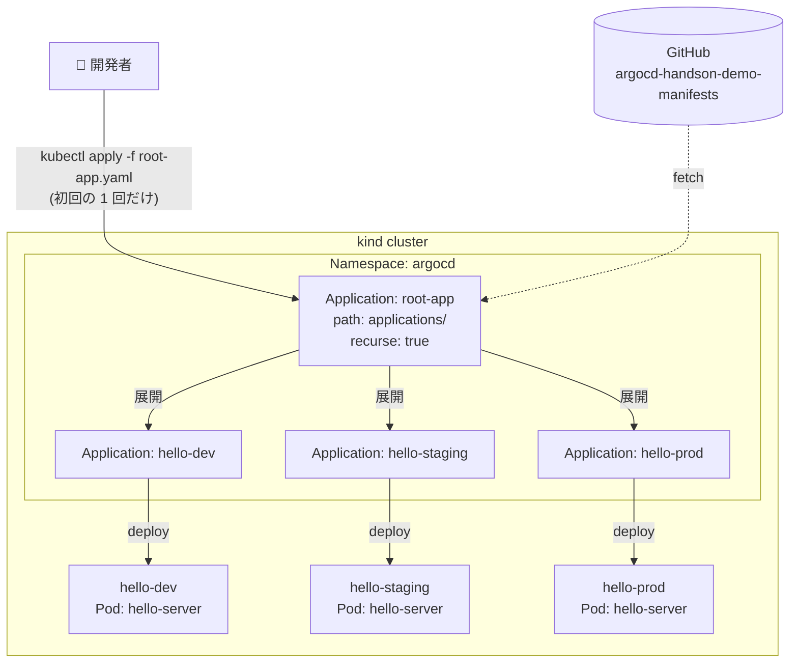

# 06 - app-of-apps

## 学習目標

- **「Application 自体も GitOps で管理する」** という app-of-apps パターンを理解する
- 1 つの **root-app** から複数の子 Application を再帰的に展開する
- kubectl 操作が **「root-app の初回 apply の 1 回だけ」** で済む状態に到達する

## 前提

- [05 Multi-environment Overlays](05-multi-environment-overlays.md) が完了している
- 3 つの Application (hello-dev/staging/prod) が稼働中

## 背景: なぜ app-of-apps が必要か

ここまでの構成:
```
あなた → kubectl apply -f applications/hello-dev.yaml      ← 手動
あなた → kubectl apply -f applications/hello-staging.yaml  ← 手動
あなた → kubectl apply -f applications/hello-prod.yaml     ← 手動
```

**問題**:
- Application マニフェスト自体は GitOps で管理されていない (kubectl 手動 apply)
- 環境追加時に `kubectl apply` を毎回叩く必要がある
- 削除や変更も手動

**app-of-apps の解**:
- **root-app** という単一の Application が `applications/` ディレクトリを監視
- 配下の YAML を **子 Application として再帰的に展開**
- 子 Application の追加/削除/変更が **git push 1 つで完結**

## アーキテクチャ



**root-app だけ初回手動 apply**、以後すべての Application 操作が git push で済みます。

## 冪等性 (再実行する場合のリセット)

```bash
# 既存 Applications 全削除 (root-app があれば cascade で子も消える)
argocd app delete root-app --cascade -y 2>/dev/null || true
for env in hello-dev hello-staging hello-prod; do
  argocd app delete $env --cascade -y 2>/dev/null || true
done
```

---

## Step 6-① 既存 3 Application のクリーンアップ

root-app に管理を引き継ぐ前にリセット:

```bash
argocd app delete hello-dev --cascade -y
argocd app delete hello-staging --cascade -y
argocd app delete hello-prod --cascade -y

argocd app list  # 空になっていること
```

**注意**: `--cascade` で配下の Pod / Service / Deployment が消える (namespace は残る場合あり、害なし)。`hello-server` の port-forward も切れます。

---

## Step 6-② root-app マニフェスト作成

`argocd-handson-demo-manifests/root-app.yaml` を新規作成:

```yaml
apiVersion: argoproj.io/v1alpha1
kind: Application
metadata:
  name: root-app
  namespace: argocd
spec:
  project: default
  source:
    repoURL: https://github.com/<USERNAME>/argocd-handson-demo-manifests.git
    targetRevision: main
    path: applications
    directory:
      recurse: true
  destination:
    server: https://kubernetes.default.svc
    namespace: argocd
  syncPolicy:
    automated:
      prune: true
      selfHeal: true
```

`<USERNAME>` を自分の GitHub ユーザー名で置換。

### root-app の構造解説

| フィールド | 値 | 意味 |
|----------|------|------|
| `name` | `root-app` | この Application の名前 |
| `metadata.namespace` | `argocd` | Application CR が置かれる namespace (Argo CD が監視) |
| `source.path` | `applications` | manifests リポジトリの `applications/` ディレクトリ |
| `directory.recurse: true` | — | 配下の YAML を再帰的に拾う (3 つの Application マニフェストを発見) |
| `destination.namespace` | `argocd` | root-app が **生成する子 Application CR を置く** namespace |
| `syncPolicy.automated.prune: true` | — | `applications/` から YAML を消したら、対応する子 Application も自動削除 |

**重要な二段階構造**:
- root-app の `destination.namespace: argocd` = 「子 Application CR をどこに作るか」
- 子 Application 自身の `destination.namespace: hello-dev/staging/prod` = 「実リソース (Pod 等) をどこに作るか」

---

## Step 6-③ commit + push

```bash
cd ~/your-workspace/argocd-handson-demo-manifests

git add root-app.yaml
git commit -m "Add root-app for app-of-apps pattern

root-app references applications/ directory and auto-syncs all
3 environment Applications (dev/staging/prod). Adding/removing
environments only requires editing applications/ in git."

git push origin main
```

---

## Step 6-④ root-app を 1 回だけ手動 apply

これが **app-of-apps での最後の手動 kubectl 操作**。以後どんな環境追加/削除も git push のみで完結します。

```bash
kubectl apply -n argocd -f ~/your-workspace/argocd-handson-demo-manifests/root-app.yaml
```

**期待される出力**:
```
application.argoproj.io/root-app created
```

---

## Step 6-⑤ 自動展開を観察

```bash
# Application 一覧 (root-app + 3 children が現れる)
argocd app list

# root-app の詳細 (子 Apps が resources として見える)
argocd app get root-app

# Pod が 3 namespace で起動するのを待つ
kubectl get pods -A | grep hello-server
```

**期待される `argocd app list` 出力**:
```
NAME                  ...  PATH              TARGET
argocd/hello-dev      ...  overlays/dev      main
argocd/hello-prod     ...  overlays/prod     main
argocd/hello-staging  ...  overlays/staging  main
argocd/root-app       ...  applications      main
```

**期待される `argocd app get root-app` 出力 (主要部分)**:
```
Sync Status:        Synced to main (xxxxxxx)
Health Status:      Healthy

GROUP        KIND         NAMESPACE  NAME           STATUS  HEALTH  HOOK  MESSAGE
argoproj.io  Application  argocd     hello-prod     Synced
argoproj.io  Application  argocd     hello-dev      Synced
argoproj.io  Application  argocd     hello-staging  Synced
```

**ポイント**:
- root-app の `Resources` に **3 つの子 Application が並ぶ** (`Kind: Application`)
- 各子 Application は通常通り Pod / Service を展開
- 全体が **2 段階のツリー構造** で動く

---

## Step 6-⑥ Argo CD UI で 2 段階ツリーを確認

UI (https://localhost:8080) を開き、`root-app` カードをクリック:

```
root-app
├── hello-dev (Application)
│   ├── Service / Deployment / ReplicaSet / Pod
├── hello-staging (Application)
│   └── ...
└── hello-prod (Application)
    └── ...
```

各子 Application をクリックするとさらに掘り下げて、その配下の Pod / Service / Deployment が見えます。**この 2 段階ツリーが app-of-apps の真骨頂**。

---

## Step 6-⑦ 疎通確認

3 つの port-forward を再起動 (前回切れているはず):

```bash
# ターミナル D
kubectl port-forward -n hello-dev svc/hello-server 8082:8081

# ターミナル E
kubectl port-forward -n hello-staging svc/hello-server 8083:8081

# ターミナル F
kubectl port-forward -n hello-prod svc/hello-server 8084:8081
```

**【メインターミナル】**:
```bash
echo "=== dev ===" && curl http://localhost:8082/
echo "=== staging ===" && curl http://localhost:8083/
echo "=== prod ===" && curl http://localhost:8084/
```

**期待出力 (Step5 と同じ、ただし全て root-app 経由で展開)**:
```
=== dev ===
Hello, Hello from DEV! [v2]
=== staging ===
Hello, Hello from STAGING! [v2]
=== prod ===
Hello, Hello from PROD! [v2]
```

---

## ここまで到達した運用世界

ここまでで **真の GitOps** が完成しました。今後の運用は:

| 操作 | 手順 |
|------|------|
| 新環境 (qa) 追加 | `overlays/qa/` + `applications/hello-qa.yaml` を git push のみ |
| 環境削除 | `applications/hello-xxx.yaml` を git rm して push、root-app が prune |
| image tag 更新 | `base/kustomization.yaml` の `newTag` 変更 → push |
| MESSAGE 変更 | `overlays/<env>/deployment-patch.yaml` 編集 → push |

**kubectl 操作はゼロ**。Argo CD UI も観察用 (操作は基本不要)。これが GitOps の到達点です。

---

## 検証

- `argocd app list` に `root-app` + 3 子 Application
- `argocd app get root-app` で `Sync Status: Synced` / `Health: Healthy`
- 3 namespace に各 1 Pod が `1/1 Running`
- 3 環境の curl レスポンスが各 MESSAGE を反映

---

## root-app の prune 動作の威力

`syncPolicy.automated.prune: true` を有効にしているため:

```bash
# 試しに prod を削除してみる (実運用前提なら慎重に)
cd ~/your-workspace/argocd-handson-demo-manifests
git rm applications/hello-prod.yaml
git commit -m "Remove prod environment"
git push origin main

# Argo CD が検知して、hello-prod Application + 配下の Pod / Service を自動削除
# (1 分以内、UI で確認可)
argocd app list
# → hello-prod が消えている
```

復活させたいなら同じファイルを add して push し直すだけ。**git の履歴 = システムの履歴** が完全に成立します。

---

## 落とし穴 (トラブルシューティング)

| 症状 | 原因 | 対処 |
|------|------|------|
| root-app は Healthy だが子 Application が現れない | `directory.recurse: true` の設定漏れ | root-app.yaml の `source.directory.recurse` を確認 |
| 子 Application の `repoURL` が古い | `<USERNAME>` 置換漏れ | 各 `applications/*.yaml` の repoURL を grep で確認 |
| `Failed to load target state: ...permission denied` | private repo へのアクセス未認証 | `argocd repo add <URL> --username ... --password ...` |
| root-app の prune で子 Application が削除されない | `prune: false` になっている | `syncPolicy.automated.prune: true` 確認 |
| 同じ Application を複数の root-app が管理 | 名前衝突 | Application 名は cluster 内で一意。root-app も含めて同名を避ける |

---

## 一次情報

- [Argo CD - Cluster Bootstrapping (app-of-apps)](https://argo-cd.readthedocs.io/en/stable/operator-manual/cluster-bootstrapping/) - 公式パターン解説
- [Argo CD - Sync Options (Prune)](https://argo-cd.readthedocs.io/en/stable/user-guide/sync-options/#prune-resources) - prune の挙動
- [Argo CD - Resource Hooks](https://argo-cd.readthedocs.io/en/stable/user-guide/resource_hooks/) - 同期前後のフック (発展)

---

ここまでで **中核 7 章完走**。以下は任意の発展課題です。

- [07 Progressive Rollout](07-progressive-rollout.md) - 環境別バージョン管理
- [08 Add Environment](08-add-environment.md) - 4 つ目の env を git push で追加
- [09 ApplicationSet](09-applicationset.md) - 複数 Application を 1 ファイルで集約
- [10 Webhook Integration](10-webhook-integration.md) - polling → 即時 sync
- [11 Notifications](11-notifications.md) - Slack 通知
- [12 Blue/Green Deployment](12-blue-green-deployment.md) - Argo Rollouts シナリオ

---

[← 前へ 05 Multi-environment Overlays](05-multi-environment-overlays.md) | [次へ → 07 Progressive Rollout](07-progressive-rollout.md)
