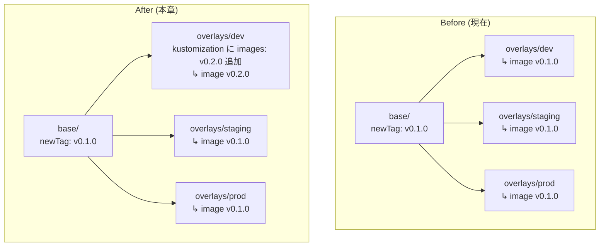

# 07 - Progressive Rollout

## 学習目標

- **環境ごとに異なる image tag** を使い分けるパターンを実装する
- 「dev → staging → prod の段階的昇格」のリハーサルを体験する
- Kustomize の `images:` ディレクティブを **overlay 階層で上書き** するテクニックを学ぶ

## 前提

- [06 app-of-apps](06-app-of-apps.md) が完了している
- 3 環境 (dev/staging/prod) が `:v0.1.0` で稼働中
- root-app による自動展開が有効

## シナリオ

> v0.2.0 を **dev だけで先行リリース** して動作確認 → 問題なければ staging に昇格 → 最後に prod。

このパターンを **overlay の `images:` で base を上書きする** ことで実現します。

## アーキテクチャ



**Kustomize の規則**: overlay 側の `images:` は base の `images:` を **上書き** する (マージではない)。

## 冪等性 (再実行する場合のリセット)

```bash
# overlays/dev/kustomization.yaml の images: ブロックを削除して、base に従う状態に戻す
# (sed か手動編集)
```

---

## Step 7-① アプリ側で v0.2.0 を準備

`HelloController.java` をさらに変更:

```java
@GetMapping("/")
public String hello() {
    return "Hello, " + message + "! [v3 - canary]\n";  // [v2] → [v3 - canary]
}
```

```bash
cd ~/your-workspace/argocd-handson-demo-app

git add src/main/java/com/example/demo/HelloController.java
git commit -m "Update HelloController to [v3 - canary] for v0.2.0"
git push origin main

# v0.2.0 タグを切る
git tag -a v0.2.0 -m "Canary release with [v3 - canary] suffix"
git push origin v0.2.0
```

---

## Step 7-② v0.2.0 image を build & kind load

```bash
docker build -t argocd-handson-demo-app:v0.2.0 .
kind load docker-image argocd-handson-demo-app:v0.2.0 --name argocd-handson

# 確認
docker exec argocd-handson-control-plane crictl images | grep argocd-handson-demo-app
# → v0.1.0 と v0.2.0 が両方並ぶ
```

---

## Step 7-③ overlays/dev/kustomization.yaml に images: ブロック追加

dev だけ v0.2.0 を使うように **overlay 階層で上書き**:

`argocd-handson-demo-manifests/overlays/dev/kustomization.yaml` を編集:

```yaml
apiVersion: kustomize.config.k8s.io/v1beta1
kind: Kustomization

namespace: hello-dev

resources:
  - ../../base

images:                              # ← 追加
  - name: argocd-handson-demo-app
    newTag: v0.2.0

patches:
  - path: deployment-patch.yaml
    target:
      kind: Deployment
      name: hello-server
```

検証:
```bash
cd ~/your-workspace/argocd-handson-demo-manifests

echo "=== dev should be v0.2.0 ==="
kubectl kustomize overlays/dev | grep "image:"
# → image: argocd-handson-demo-app:v0.2.0

echo "=== staging should still be v0.1.0 ==="
kubectl kustomize overlays/staging | grep "image:"
# → image: argocd-handson-demo-app:v0.1.0

echo "=== prod should still be v0.1.0 ==="
kubectl kustomize overlays/prod | grep "image:"
# → image: argocd-handson-demo-app:v0.1.0
```

dev のみ v0.2.0、staging/prod は v0.1.0 のまま (overlay の `images:` が base の `images:` を上書きしている)。

---

## Step 7-④ commit + push

```bash
git add overlays/dev/kustomization.yaml
git commit -m "Canary release v0.2.0 to dev only"
git push origin main
```

Argo CD UI で `hello-dev` のみが `Sync` を再実行し、Pod が v0.2.0 で再起動します。staging/prod は無変更。

---

## Step 7-⑤ 動作確認

3 つの port-forward (まだ動いていれば再利用、切れていれば再起動):

```bash
# ターミナル D / E / F で各 namespace の port-forward
# (略: 06 章と同じ)

curl http://localhost:8082/   # dev
curl http://localhost:8083/   # staging
curl http://localhost:8084/   # prod
```

**期待出力**:
```
$ curl http://localhost:8082/
Hello, Hello from DEV! [v3 - canary]   ← dev だけ v0.2.0

$ curl http://localhost:8083/
Hello, Hello from STAGING! [v2]        ← staging は v0.1.0 のまま

$ curl http://localhost:8084/
Hello, Hello from PROD! [v2]           ← prod は v0.1.0 のまま
```

dev で `[v3 - canary]`、staging/prod で `[v2]` が見えれば canary 状態が成立 ✓

---

## Step 7-⑥ staging への昇格

dev で動作確認できたら staging に展開:

`overlays/staging/kustomization.yaml` にも `images:` ブロックを追加:

```yaml
images:
  - name: argocd-handson-demo-app
    newTag: v0.2.0
```

```bash
git add overlays/staging/kustomization.yaml
git commit -m "Promote v0.2.0 to staging"
git push origin main
```

確認:
```bash
curl http://localhost:8083/
# Hello, Hello from STAGING! [v3 - canary]
```

---

## Step 7-⑦ prod への昇格 (全環境統一)

prod まで上げる時は **overlay の上書きを消して base に揃える** のが綺麗:

### 方法 A: base/kustomization.yaml を v0.2.0 に上げる

```yaml
# base/kustomization.yaml
images:
  - name: argocd-handson-demo-app
    newTag: v0.2.0
```

そして overlays/dev/staging の `images:` ブロックを削除 (base に従う)。

### 方法 B: overlays/prod にも images: を追加

シンプルだが、後で base を上げると 3 環境とも overlay 上書きを残すことになる。

**推奨は方法 A** (base が真実の源、overlay は一時的差分のみに使う)。

```bash
# base/kustomization.yaml の newTag を v0.2.0 に変更
# overlays/dev/kustomization.yaml と overlays/staging/kustomization.yaml の images: ブロックを削除

git add base/kustomization.yaml overlays/dev/kustomization.yaml overlays/staging/kustomization.yaml
git commit -m "Promote v0.2.0 to all envs (base unified)"
git push origin main
```

確認:
```bash
for port in 8082 8083 8084; do
  curl http://localhost:$port/
done
# 3 環境とも [v3 - canary] になる
```

---

## 検証

- canary フェーズ: dev で `[v3 - canary]`、staging/prod で `[v2]`
- staging 昇格: dev/staging で `[v3 - canary]`、prod で `[v2]`
- 全環境統一: 3 環境とも `[v3 - canary]`

---

## 落とし穴

| 症状 | 原因 | 対処 |
|------|------|------|
| `images:` を追加しても dev の image が変わらない | name が deployment の image 名と不一致 | base/deployment.yaml の `image:` 名と完全一致しているか確認 (`argocd-handson-demo-app`) |
| 上書きしたつもりが base のまま | overlay の YAML 構文エラー | `kubectl kustomize overlays/dev` で render を確認 |
| staging も影響を受けた | 編集したファイルの間違い | `git diff HEAD~1` で何を変えたか確認 |

---

## 一次情報

- [Kustomize - Per-overlay images directive](https://kubectl.docs.kubernetes.io/references/kustomize/builtins/#_imagetagtransformer_) - images の継承/上書きルール
- [Argo CD - Multiple Sources for an Application (発展)](https://argo-cd.readthedocs.io/en/stable/user-guide/multiple_sources/) - 複数ソースの参照

---

[← 前へ 06 app-of-apps](06-app-of-apps.md) | [次へ → 08 Add Environment](08-add-environment.md)
