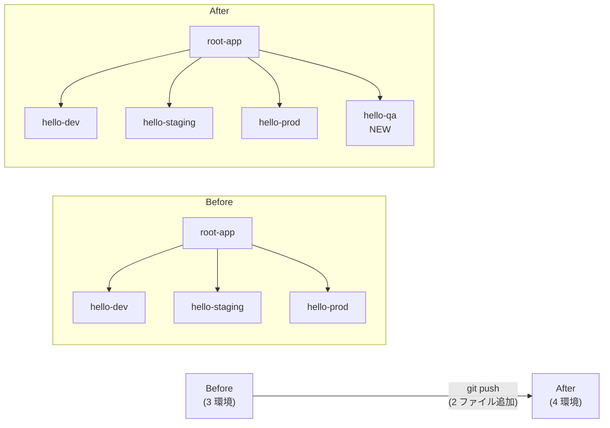

# 08 - Add Environment (4 つ目の qa を 1 push で追加)

## 学習目標

- root-app が **新しい env を git push 1 つで自動展開** することを体験する
- kubectl 操作ゼロでの環境追加 = 真の GitOps を実感する

## 前提

- [06 app-of-apps](06-app-of-apps.md) が完了している (root-app 稼働中)

## アーキテクチャ



## シナリオ

開発チームから「新人研修用に **qa 環境** が欲しい」とリクエスト。

**従来の運用**: kubectl apply / argocd app create を運用担当者が手動実行 → 設定変更履歴が散在

**GitOps 運用**: git push 1 回 → root-app が勝手に展開、変更履歴は git ログに完全保存

---

## Step 8-① overlays/qa/ ディレクトリ作成

`argocd-handson-demo-manifests/overlays/qa/kustomization.yaml`:

```yaml
apiVersion: kustomize.config.k8s.io/v1beta1
kind: Kustomization

namespace: hello-qa

resources:
  - ../../base

patches:
  - path: deployment-patch.yaml
    target:
      kind: Deployment
      name: hello-server
```

`overlays/qa/deployment-patch.yaml`:

```yaml
apiVersion: apps/v1
kind: Deployment
metadata:
  name: hello-server
spec:
  template:
    spec:
      containers:
        - name: hello-server
          env:
            - name: MESSAGE
              value: "Hello from QA"
```

---

## Step 8-② applications/hello-qa.yaml 作成

```yaml
apiVersion: argoproj.io/v1alpha1
kind: Application
metadata:
  name: hello-qa
  namespace: argocd
  finalizers:
    - resources-finalizer.argocd.argoproj.io
spec:
  project: default
  source:
    repoURL: https://github.com/<USERNAME>/argocd-handson-demo-manifests.git
    targetRevision: main
    path: overlays/qa
  destination:
    server: https://kubernetes.default.svc
    namespace: hello-qa
  syncPolicy:
    automated:
      prune: true
      selfHeal: true
    syncOptions:
      - CreateNamespace=true
```

---

## Step 8-③ git push 1 回だけで完結

```bash
cd ~/your-workspace/argocd-handson-demo-manifests

git add overlays/qa/ applications/hello-qa.yaml
git status
# → 新規: overlays/qa/kustomization.yaml
# → 新規: overlays/qa/deployment-patch.yaml
# → 新規: applications/hello-qa.yaml

git commit -m "Add qa environment"
git push origin main
```

**ここで `kubectl` も `argocd` CLI も叩いていない** 点に注目。

---

## Step 8-④ Argo CD が自動展開するのを観察

```bash
# 1〜2 分待ってから
argocd app list
```

**期待される出力**:
```
NAME                  ...  PATH              TARGET
argocd/hello-dev      ...  overlays/dev      main
argocd/hello-prod     ...  overlays/prod     main
argocd/hello-qa       ...  overlays/qa       main   ← 新しく現れる
argocd/hello-staging  ...  overlays/staging  main
argocd/root-app       ...  applications      main
```

```bash
kubectl get pods -A | grep hello-server
# → hello-qa namespace に新しい Pod が起動している
```

---

## Step 8-⑤ 動作確認

```bash
# 4 つ目の port-forward (新しいターミナル G)
kubectl port-forward -n hello-qa svc/hello-server 8085:8081
```

別ターミナルで:
```bash
curl http://localhost:8085/
```

**期待出力**:
```
Hello, Hello from QA! [v3 - canary]   ← もし 07 章まで進んでいれば
# または
Hello, Hello from QA! [v2]            ← 06 章直後の場合
```

---

## 検証

- `argocd app list` に `hello-qa` が追加
- `kubectl get pods -n hello-qa` で Pod が `1/1 Running`
- curl で QA 環境のレスポンス取得

---

## qa 環境を削除する (逆操作)

```bash
git rm applications/hello-qa.yaml
git rm -r overlays/qa/
git commit -m "Remove qa environment"
git push origin main
```

root-app の prune が効いて、自動的に `hello-qa` Application + 配下の Pod / Service / namespace の中身が消える。**git の履歴 = システムの履歴** の完全な実装。

---

## ここで気づいてほしいこと

このフローを 1 度体験すると、**「Application マニフェストを git に置く」というシンプルなアイデアの威力** がわかります。

- 環境追加: ファイル 3 つ追加 + push
- 環境削除: ファイル削除 + push
- 設定変更: ファイル編集 + push
- 履歴監査: `git log` で完全可視

**運用担当者の手作業が全廃される世界**。チーム規模が大きくなるほど効果が出るパターンです。

---

## 落とし穴

| 症状 | 原因 | 対処 |
|------|------|------|
| 1 分待っても hello-qa が現れない | root-app の polling 待ち (デフォルト 3 分) | UI で root-app を Refresh、もしくは `argocd app sync root-app` |
| `Sync Status: Unknown` | path 指定ミス | applications/hello-qa.yaml の `source.path` が `overlays/qa` か確認 |
| Pod が起動しない | overlay の構文エラー | `kubectl kustomize overlays/qa` で事前検証 |

---

## 一次情報

- [Argo CD - Cluster Bootstrapping](https://argo-cd.readthedocs.io/en/stable/operator-manual/cluster-bootstrapping/) - app-of-apps の挙動
- [Argo CD - Sync Options](https://argo-cd.readthedocs.io/en/stable/user-guide/sync-options/) - prune / selfHeal の細かい挙動

---

[← 前へ 07 Progressive Rollout](07-progressive-rollout.md) | [次へ → 09 ApplicationSet](09-applicationset.md)
