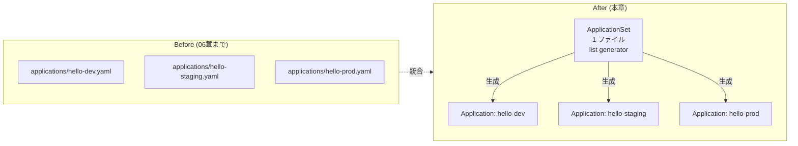

# 09 - ApplicationSet (List Generator で集約)

## 学習目標

- 複数の Application マニフェストの **冗長性問題** を理解する
- **ApplicationSet** で 1 ファイルから N 個の Application を生成する
- **List Generator** の使い方を体験する (Cluster / Git Generator も概念紹介)

## 前提

- [06 app-of-apps](06-app-of-apps.md) が完了している
- 3〜4 環境分の Application マニフェストが `applications/` にある

## 背景: Application マニフェストの冗長性

現状 (06 章まで) の `applications/` ディレクトリ:

```
applications/
├── hello-dev.yaml       ← 構造ほぼ同じ
├── hello-staging.yaml   ← 構造ほぼ同じ
└── hello-prod.yaml      ← 構造ほぼ同じ
```

3 ファイルとも:
- `kind: Application`
- `repoURL`, `targetRevision`, `destination.server`, `syncPolicy` が同一
- 異なるのは **`name`、`source.path`、`destination.namespace`** だけ

**3 環境なら手動コピペで耐えられるが、10 環境、20 環境になると地獄**。

## アーキテクチャ



**ApplicationSet** = Application を量産する CRD。Generator (List/Cluster/Git/PR/Matrix) が変数のセットを生成し、template フィールドで各 Application を組み立てる。

## ApplicationSet の代表的な Generator

| Generator | 用途 |
|----------|------|
| **List** | 静的に環境名の配列を渡す (本章で使用) |
| Cluster | Argo CD に登録された全 cluster (or label 指定) から自動生成 |
| Git | Git リポジトリのディレクトリ/ファイルを走査して生成 |
| PullRequest | GitHub/GitLab の open PR ごとに preview 環境を生成 |
| Matrix | 複数 Generator を直積結合 |

## 冪等性 (再実行する場合のリセット)

```bash
# 既存の hello-* Application を一旦削除 (ApplicationSet で再生成する)
for env in hello-dev hello-staging hello-prod hello-qa; do
  argocd app delete $env --cascade -y 2>/dev/null || true
done
```

---

## Step 9-① ApplicationSet マニフェスト作成

`argocd-handson-demo-manifests/applications/hello-appset.yaml`:

```yaml
apiVersion: argoproj.io/v1alpha1
kind: ApplicationSet
metadata:
  name: hello-appset
  namespace: argocd
spec:
  goTemplate: true
  generators:
    - list:
        elements:
          - env: dev
          - env: staging
          - env: prod
  template:
    metadata:
      name: 'hello-{{.env}}'
      finalizers:
        - resources-finalizer.argocd.argoproj.io
    spec:
      project: default
      source:
        repoURL: https://github.com/<USERNAME>/argocd-handson-demo-manifests.git
        targetRevision: main
        path: 'overlays/{{.env}}'
      destination:
        server: https://kubernetes.default.svc
        namespace: 'hello-{{.env}}'
      syncPolicy:
        automated:
          prune: true
          selfHeal: true
        syncOptions:
          - CreateNamespace=true
```

`<USERNAME>` を自分の GitHub ユーザー名で置換。

### 解説

- `goTemplate: true`: Go template 構文 (`{{.env}}`) を使う
- `list.elements`: 環境名のリストを与える (静的)
- `template`: 各 element に対して生成される Application のひな形
- `{{.env}}` が `dev` / `staging` / `prod` に置換され、3 つの Application が自動生成される

---

## Step 9-② 既存 Application マニフェストを削除

`applications/hello-dev.yaml` `hello-staging.yaml` `hello-prod.yaml` を削除 (ApplicationSet が同じものを生成するので重複回避):

```bash
cd ~/your-workspace/argocd-handson-demo-manifests
rm applications/hello-dev.yaml
rm applications/hello-staging.yaml
rm applications/hello-prod.yaml
# (08 章で hello-qa を作っていれば、それも削除 or list に追加)
```

`applications/` の中身は `hello-appset.yaml` のみになります。

---

## Step 9-③ commit + push

```bash
git add applications/
git status
# 削除: applications/hello-dev.yaml
# 削除: applications/hello-staging.yaml
# 削除: applications/hello-prod.yaml
# 新規: applications/hello-appset.yaml

git commit -m "Replace 3 Application manifests with ApplicationSet (List Generator)"
git push origin main
```

---

## Step 9-④ root-app が ApplicationSet を展開

root-app は `applications/` を再帰的に監視しているので、ApplicationSet も自動的に拾います。

```bash
# 1〜2 分待ってから
kubectl get applicationsets -n argocd
# NAME           AGE
# hello-appset   1m

argocd app list
# argocd/hello-dev      ...  ← ApplicationSet が生成
# argocd/hello-prod     ...
# argocd/hello-staging  ...
# argocd/root-app       ...
```

ApplicationSet は **3 つの Application を自動生成** します。生成された Application は通常通り Pod / Service を展開します。

---

## Step 9-⑤ 動作確認

3 環境の Pod が稼働していることを確認:

```bash
kubectl get pods -A | grep hello-server
```

curl で各 namespace へ:
```bash
curl http://localhost:8082/   # dev
curl http://localhost:8083/   # staging
curl http://localhost:8084/   # prod
```

06 章までと同じレスポンスが返れば OK。

---

## Step 9-⑥ 環境追加が 1 行で完結する体験

ApplicationSet の `list.elements` に 1 行追加するだけで qa 環境が増える:

```yaml
generators:
  - list:
      elements:
        - env: dev
        - env: staging
        - env: prod
        - env: qa     # ← 1 行追加
```

```bash
git add applications/hello-appset.yaml
git commit -m "Add qa env to ApplicationSet"
git push origin main
```

(注: `overlays/qa/` も同時に push する必要あり、Step 08 章で作成済みなら不要)

`hello-qa` Application が自動生成される。

---

## ApplicationSet vs app-of-apps の使い分け

| 観点 | app-of-apps (06 章) | ApplicationSet (本章) |
|------|--------------------|----------------------|
| 1 ファイルあたり | 1 Application | N 個生成 |
| 各 Application の差分 | 個別 YAML で柔軟に書ける | template 化、generator から変数注入のみ |
| 冗長性 | 環境ごとにファイル必要 | 1 ファイルで N 環境 |
| 直感性 | 高い (1 ファイル = 1 環境) | やや抽象 (template + generator の概念) |
| 動的生成 | 不可 | Cluster/Git/PR Generator で動的展開可 |

**実務の判断基準**: 環境数が 5 以下で個別調整が多いなら app-of-apps、6 以上 or 動的生成が必要なら ApplicationSet。

---

## 検証

- `kubectl get applicationsets -n argocd` で `hello-appset` が存在
- `argocd app list` に 3 (or 4) 環境分の Application が並ぶ
- 各環境の Pod が正常稼働

---

## 他 Generator のチラ見せ

### Cluster Generator (複数クラスタ管理)
```yaml
generators:
  - clusters: {}  # Argo CD に登録された全クラスタに展開
```

### Git Generator (ディレクトリ走査)
```yaml
generators:
  - git:
      repoURL: https://github.com/<USERNAME>/argocd-handson-demo-manifests.git
      revision: main
      directories:
        - path: overlays/*
```

`overlays/*` で見つかった全ディレクトリ (dev/staging/prod) を自動展開。**list を手書きしなくて済む**。

---

## 落とし穴

| 症状 | 原因 | 対処 |
|------|------|------|
| ApplicationSet 適用後も既存 Application が残る | 重複名 | 旧 Application を `argocd app delete` で削除、もしくは `applications/hello-*.yaml` を git から削除 |
| `goTemplate: true` を忘れる | デフォルトは fasttemplate (`{{key}}` 構文) | 明示的に `goTemplate: true` 指定推奨 (より柔軟、Sprig 関数も使える) |
| template 内で `{{ .env }}` が展開されない | スペース必須 | `'{{.env}}'` または `'{{ .env }}'` (どちらでも OK) |

---

## 一次情報

- [Argo CD - ApplicationSet](https://argo-cd.readthedocs.io/en/stable/operator-manual/applicationset/) - 公式ドキュメント
- [ApplicationSet - List Generator](https://argo-cd.readthedocs.io/en/stable/operator-manual/applicationset/Generators-List/) - List の詳細
- [ApplicationSet - Cluster Generator](https://argo-cd.readthedocs.io/en/stable/operator-manual/applicationset/Generators-Cluster/) - 多クラスタ展開
- [ApplicationSet - Git Generator](https://argo-cd.readthedocs.io/en/stable/operator-manual/applicationset/Generators-Git/) - リポジトリ走査
- [ApplicationSet - Template Fields](https://argo-cd.readthedocs.io/en/stable/operator-manual/applicationset/Template/) - template 詳細

---

[← 前へ 08 Add Environment](08-add-environment.md) | [次へ → 10 Webhook Integration](10-webhook-integration.md)
