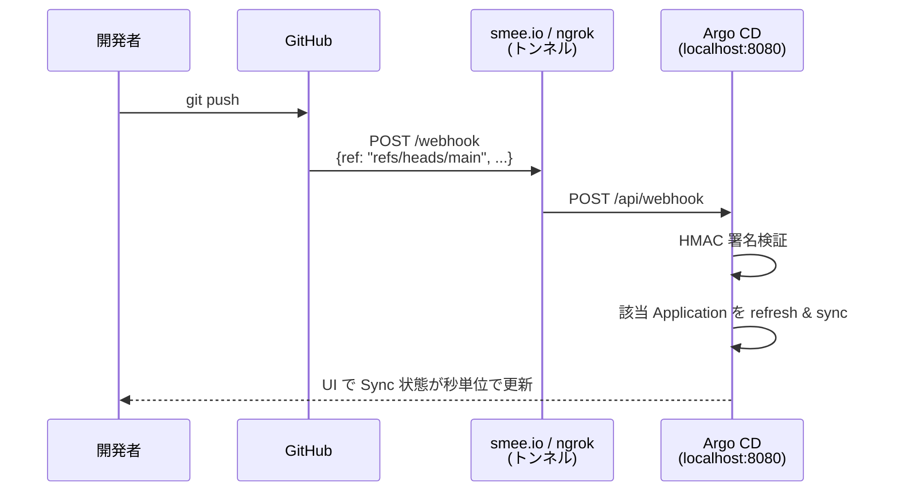

# 10 - Webhook Integration (GitHub → 即時 sync)

## 学習目標

- Argo CD のデフォルト polling (最大 3 分遅延) の限界を理解する
- **GitHub Webhook** を Argo CD に向けて、push の数秒後に sync する構成を作る
- ローカル kind 環境で **smee.io / ngrok / Cloudflare Tunnel** を使って localhost を公開する方法を学ぶ

## 前提

- [06 app-of-apps](06-app-of-apps.md) が完了している
- GitHub への push 権限がある
- インターネットに繋がる環境

## 背景: なぜ Webhook が必要か

| アプローチ | 反映までの時間 |
|-----------|--------------|
| デフォルト (polling) | 最大 **3 分** (`timeout.reconciliation` の設定値) |
| Webhook | **数秒** |

GitHub Webhook は push イベントを Argo CD の `/api/webhook` エンドポイントに通知し、即座に refresh & sync を引き起こします ([Argo CD Webhook 公式](https://argo-cd.readthedocs.io/en/stable/operator-manual/webhook/))。

## アーキテクチャ



ローカル kind では Argo CD は localhost のみで listen しているため、**外部 → ローカル** に届ける中継が必要 (smee.io か ngrok か Cloudflare Tunnel)。

## 冪等性 (再実行する場合のリセット)

```bash
# 既存 webhook secret を削除して再作成する場合
kubectl -n argocd delete secret argocd-secret --ignore-not-found
# (注: argocd-secret は他の用途にも使われるため慎重に。本章は patch で対応推奨)
```

---

## Step 10-① smee.io でトンネル URL を取得 (簡単な選択肢)

[smee.io](https://smee.io/) にアクセスし、**Start a new channel** をクリック。表示される URL (例: `https://smee.io/AbCdEfGhIjKlMnOp`) を控える。

代替: ngrok や Cloudflare Tunnel も使えるが、smee は **無料・無設定・恒久 URL** で最も手軽。

---

## Step 10-② smee-client をローカルで起動

smee は Node.js 製のクライアントが必要:

```bash
# Node.js が無ければインストール (省略)
npm install -g smee-client

# トンネル起動 (smee の URL → localhost:8080/api/webhook へ転送)
smee --url https://smee.io/AbCdEfGhIjKlMnOp \
     --target https://localhost:8080/api/webhook \
     --port 8080
```

このプロセスは **常時起動しっぱなし** にする (新しいターミナルで)。

---

## Step 10-③ Webhook secret を生成して Argo CD に登録

ランダムな secret を生成:
```bash
WEBHOOK_SECRET=$(openssl rand -hex 32)
echo $WEBHOOK_SECRET
# 例: 7a4f8e9c... (この値を控える)
```

Argo CD の `argocd-secret` に追加:

```bash
kubectl -n argocd patch secret argocd-secret \
  -p '{"stringData": {"webhook.github.secret": "'"$WEBHOOK_SECRET"'"}}'
```

確認:
```bash
kubectl -n argocd get secret argocd-secret -o yaml | grep github
```

---

## Step 10-④ GitHub 側で Webhook 設定

`argocd-handson-demo-manifests` リポジトリの GitHub ページで:

1. **Settings → Webhooks → Add webhook**
2. **Payload URL**: smee.io の URL (例: `https://smee.io/AbCdEfGhIjKlMnOp`)
3. **Content type**: `application/json`
4. **Secret**: Step 10-③ の `$WEBHOOK_SECRET` 値
5. **Which events?**: `Just the push event.` を選択
6. **Active**: ✅
7. **Add webhook** クリック

GitHub が即座に test ping を送り、smee 経由で Argo CD に届く。smee の Web UI でリクエスト履歴が見えるので疎通確認可能。

---

## Step 10-⑤ 動作確認

```bash
# manifests に何か小さい変更を入れて push
cd ~/your-workspace/argocd-handson-demo-manifests
echo "" >> README.md
git add README.md
git commit -m "Test webhook trigger"
git push origin main
```

**期待される動作**:
- 数秒以内に smee の Web UI に POST が到着
- smee-client がそれを localhost:8080 に転送
- Argo CD が refresh、UI で `Sync Status` が瞬時に変化
- (実際にマニフェスト変更がある場合) auto-sync が走る

`argocd app get root-app` を打つと、`Last Refresh` 時刻が push 直後になっているはず。

---

## 別案: ngrok / Cloudflare Tunnel

### ngrok 案
```bash
# ngrok インストール後
ngrok http 8080
# https://xxxx.ngrok.io が発行される → これを GitHub の Payload URL に
```

### Cloudflare Tunnel 案
```bash
cloudflared tunnel --url https://localhost:8080
# https://xxxx.trycloudflare.com が発行される
```

どちらも smee と同様、**外部 URL → localhost:8080** の転送を担います。

---

## 検証

- smee の Web UI で push 後すぐに POST 受信
- Argo CD の `argocd app get` で `Last Refresh` 時刻が push 直後
- 大きな変更を push してから 5 秒以内に Pod が再作成される

---

## セキュリティ考慮

- **Webhook Secret は必ず設定** (HMAC-SHA256 署名検証で偽リクエスト防止)
- smee.io は誰でもアクセス可能なため、本番運用には不向き (学習用)
- 本番では **Argo CD を Ingress 経由でインターネット公開** + GitHub IP allowlist 設定

---

## 落とし穴

| 症状 | 原因 | 対処 |
|------|------|------|
| GitHub から smee にリクエストが届かない | Webhook の URL 誤り | smee の URL 末尾に / が無いか、Payload URL を再確認 |
| smee は受信しているが Argo CD が反応しない | smee-client 未起動 / target URL 誤り | `--target` が `https://localhost:8080/api/webhook` (path 必須) |
| `signature does not match` エラー | secret 不一致 | GitHub と Argo CD secret の値が完全一致しているか確認 |
| TLS 証明書エラー | localhost の自己署名証明書 | smee-client は `--rejectUnauthorized=false` を内部で設定 (デフォルト挙動) |

---

## 一次情報

- [Argo CD - Webhook Configuration](https://argo-cd.readthedocs.io/en/stable/operator-manual/webhook/) - 公式 webhook 設定
- [smee.io](https://smee.io/) - GitHub 推奨のテスト用 webhook proxy
- [GitHub Webhooks](https://docs.github.com/en/webhooks) - GitHub Webhook 全般
- [GitHub Webhook Security](https://docs.github.com/en/webhooks/using-webhooks/securing-your-webhooks) - HMAC 署名検証

---

[← 前へ 09 ApplicationSet](09-applicationset.md) | [次へ → 11 Notifications](11-notifications.md)
