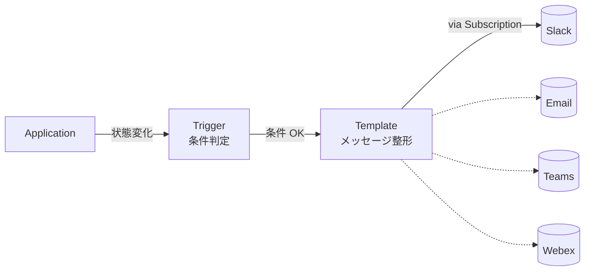

# 11 - Notifications (Slack 連携)

## 学習目標

- Argo CD の **Notifications** 機能で sync イベントを Slack 等に通知する
- **Trigger / Template / Subscription** の 3 概念を理解する
- 失敗時アラート / デプロイ完了通知を実装する

## 前提

- [06 app-of-apps](06-app-of-apps.md) が完了している
- Slack ワークスペース管理権限 (Incoming Webhook URL を発行できる)

## 背景

Argo CD の sync 結果を **能動的に通知** したいケース:

- prod の sync が失敗した → 即座に対応
- リリース完了 → チーム全体に告知
- OutOfSync が長時間続く → 担当者にエスカレーション

`argocd-notifications-controller` は **Argo CD の install.yaml に同梱** されており、追加導入不要 (`kubectl get pods -n argocd | grep notifications` で確認できる)。

## アーキテクチャ



3 概念:
- **Trigger**: 「いつ送るか」の判定ロジック (Go template + AviExpr)
- **Template**: 「何を送るか」のメッセージ本文
- **Subscription**: 「どこに送るか」(Slack channel など) を Application に紐付け

## 冪等性 (再実行する場合のリセット)

```bash
# 既存設定を削除して再作成する場合
kubectl -n argocd delete configmap argocd-notifications-cm --ignore-not-found
kubectl -n argocd delete secret argocd-notifications-secret --ignore-not-found
```

---

## Step 11-① Slack Incoming Webhook URL 取得

1. <https://api.slack.com/apps> から **Create New App → From scratch**
2. App 名と workspace を選択
3. **Incoming Webhooks** → **Activate Incoming Webhooks** ON
4. **Add New Webhook to Workspace** → 通知先 channel を選択
5. **Webhook URL** をコピー (例: `https://hooks.slack.com/services/T01.../B02.../xxx`)

---

## Step 11-② Argo CD に Slack 接続情報を登録

```bash
SLACK_WEBHOOK_URL="https://hooks.slack.com/services/T01.../B02.../xxx"

kubectl -n argocd create secret generic argocd-notifications-secret \
  --from-literal=slack-token="$SLACK_WEBHOOK_URL" \
  --dry-run=client -o yaml | kubectl apply -f -
```

---

## Step 11-③ argocd-notifications-cm を設定

`argocd-notifications-cm.yaml`:

```yaml
apiVersion: v1
kind: ConfigMap
metadata:
  name: argocd-notifications-cm
  namespace: argocd
data:
  service.webhook.slack: |
    url: $slack-token
    headers:
    - name: Content-Type
      value: application/json

  template.app-deployed: |
    webhook:
      slack:
        method: POST
        body: |
          {
            "text": "✅ *{{.app.metadata.name}}* deployed successfully\n• Sync: {{.app.status.sync.status}}\n• Health: {{.app.status.health.status}}\n• Revision: `{{.app.status.sync.revision | substr 0 7}}`"
          }

  template.app-sync-failed: |
    webhook:
      slack:
        method: POST
        body: |
          {
            "text": "🚨 *{{.app.metadata.name}}* sync FAILED\n• Repo: {{.app.spec.source.repoURL}}\n• Path: {{.app.spec.source.path}}\n• Operation: {{.app.status.operationState.message}}"
          }

  trigger.on-deployed: |
    - description: Application is synced and healthy
      send:
        - app-deployed
      when: app.status.operationState.phase in ['Succeeded'] and app.status.health.status == 'Healthy'

  trigger.on-sync-failed: |
    - description: Application sync failed
      send:
        - app-sync-failed
      when: app.status.operationState.phase in ['Error', 'Failed']

  subscriptions: |
    - recipients:
        - webhook:slack
      triggers:
        - on-deployed
        - on-sync-failed
```

```bash
kubectl apply -f argocd-notifications-cm.yaml
```

ポイント:
- `service.webhook.slack`: Slack の Incoming Webhook を「webhook」サービスとして定義
- `template.app-deployed`: 成功時のメッセージ本文 (Slack の JSON 形式)
- `template.app-sync-failed`: 失敗時のメッセージ
- `trigger.on-deployed`: 成功判定ロジック
- `trigger.on-sync-failed`: 失敗判定
- `subscriptions`: 全 Application に対してこれらの trigger を有効化

---

## Step 11-④ notifications-controller を再起動

設定反映のため:

```bash
kubectl -n argocd rollout restart deployment argocd-notifications-controller
kubectl -n argocd rollout status deployment argocd-notifications-controller
```

---

## Step 11-⑤ 動作確認

manifests に変更を加えて push し、Argo CD が sync するのを待つ:

```bash
cd ~/your-workspace/argocd-handson-demo-manifests
# 何か小さい変更 (例: deployment の MESSAGE を変える)
git add overlays/dev/deployment-patch.yaml
git commit -m "Test notification trigger"
git push origin main
```

数十秒〜3 分以内 (10 章の webhook を組み合わせれば数秒) に Slack channel に:
```
✅ hello-dev deployed successfully
• Sync: Synced
• Health: Healthy
• Revision: a1b2c3d
```

のようなメッセージが届けば成功。

### 失敗通知のテスト
わざと壊れた YAML を push して `Sync Failed` メッセージが来るか確認:

```yaml
# overlays/dev/deployment-patch.yaml にわざと不正な構文を入れる
apiVersion: apps/v1
kind: Deployment
metadata:
  name: hello-server
spec:
  template:
    spec:
      containers:
        - name: hello-server
          this-is-invalid-field: "broken"
```

```bash
git commit -am "Trigger sync failure"
git push origin main
```

```
🚨 hello-dev sync FAILED
• Repo: https://github.com/.../argocd-handson-demo-manifests.git
• Path: overlays/dev
• Operation: ComparisonError: failed to ...
```

確認後、元に戻す:
```bash
git revert HEAD
git push origin main
```

---

## 別チャネル例

### Email (SMTP)
```yaml
service.email: |
  host: smtp.gmail.com
  port: 587
  from: alerts@example.com
  username: $email-username
  password: $email-password
```

### Microsoft Teams
```yaml
service.teams: |
  recipientUrls:
    main: $teams-webhook
```

### Generic Webhook (任意のサービス)
```yaml
service.webhook.my-system: |
  url: https://my-internal.example.com/api/notify
  basicAuth:
    username: $webhook-user
    password: $webhook-pass
```

---

## アプリケーション単位での購読制御

特定の Application だけ通知 ON にしたい場合は、Application metadata に annotation を付ける:

```yaml
metadata:
  annotations:
    notifications.argoproj.io/subscribe.on-deployed.slack: "<channel-name>"
```

逆に subscriptions 全体オフ + 個別 application で opt-in もできる。

---

## 検証

- Slack channel に sync 完了メッセージが届く
- 意図的に壊した push で失敗メッセージが届く
- 数十秒以内 (webhook 連携時は数秒) のレイテンシ

---

## 落とし穴

| 症状 | 原因 | 対処 |
|------|------|------|
| メッセージが届かない | secret の URL 値が違う | `kubectl -n argocd get secret argocd-notifications-secret -o yaml` で base64 デコードして確認 |
| `service.webhook.slack` が認識されない | configmap の YAML 構文ミス | `kubectl -n argocd get cm argocd-notifications-cm -o yaml` で確認、再 apply |
| trigger 条件が真にならない | when 式の AviExpr 文法 | [argocd-notifications expression docs](https://argocd-notifications.readthedocs.io/en/stable/triggers/) 参照 |
| controller が起動しない | image pull 失敗、初期エラー | `kubectl logs -n argocd deployment/argocd-notifications-controller` で確認 |

---

## 一次情報

- [Argo CD - Notifications](https://argo-cd.readthedocs.io/en/stable/operator-manual/notifications/) - 公式 (現在は Argo CD 本体に統合)
- [argocd-notifications.readthedocs.io](https://argocd-notifications.readthedocs.io/en/stable/) - 詳細リファレンス (旧プロジェクト URL、内容は最新版で有効)
- [Notifications - Triggers](https://argocd-notifications.readthedocs.io/en/stable/triggers/) - 全 Trigger 一覧
- [Notifications - Templates](https://argocd-notifications.readthedocs.io/en/stable/templates/) - Template 構文
- [Notifications - Services](https://argocd-notifications.readthedocs.io/en/stable/services/overview/) - Slack/Email/Teams 等の連携
- [Slack Incoming Webhooks](https://api.slack.com/messaging/webhooks) - Slack 側の設定

---

[← 前へ 10 Webhook Integration](10-webhook-integration.md) | [次へ → 12 Blue/Green Deployment](12-blue-green-deployment.md)
