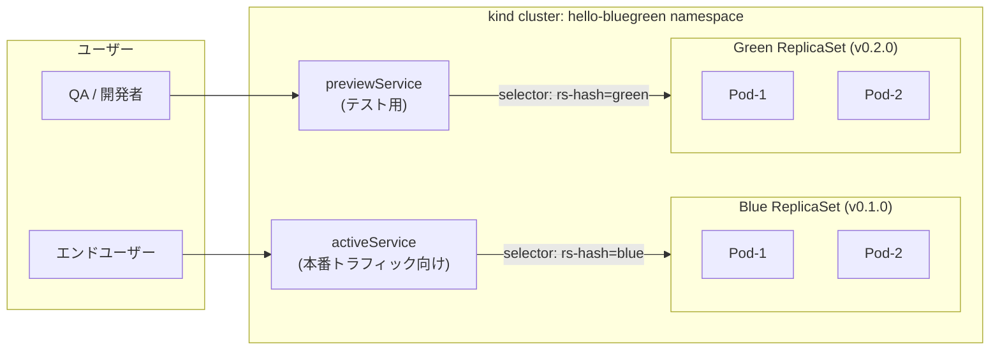
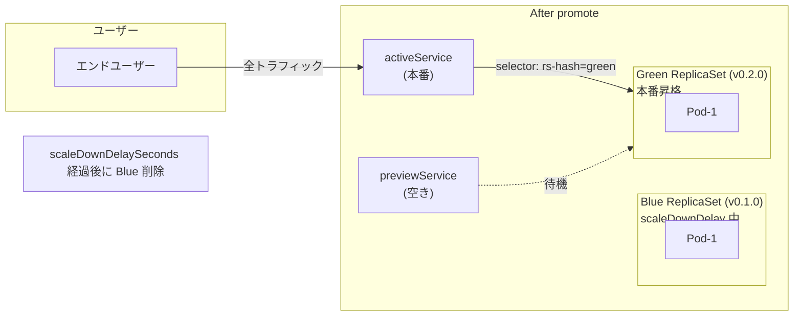
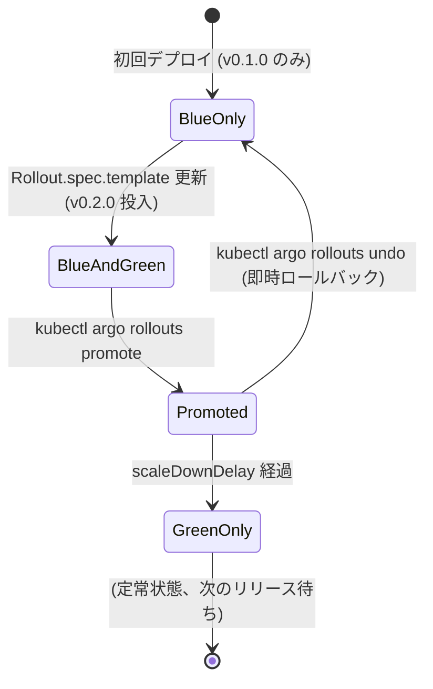

# 12 - Blue/Green Deployment (Argo Rollouts)

## Blue/Green デプロイの定義

> Blue/Green デプロイは、アプリケーションの新しいバージョンを本番環境にデプロイする際に、**従来の運用方法とは異なり、新しいバージョンを本番環境に構築し、そこでアプリケーションをテストした後、従来の本番環境と切り替える** 方法。

ローリングアップデート (順次置換) と異なり:

- **Blue (現本番)** はずっと稼働を続ける = ユーザーへの影響ゼロ
- **Green (新本番)** を **同じクラスタ内に並列で構築** し、本番トラフィックには出さずに内部テスト
- 検証完了後、**Service のセレクタ切り替え** で全トラフィックを瞬時に Blue → Green へ
- 問題発覚時は **逆に切り戻すだけで即時ロールバック** (Green を破棄するだけで Blue がそのまま生きている)

このパターンを **Argo Rollouts** の `Rollout` リソース (Deployment の上位互換) と `activeService` / `previewService` の 2 つの Service で実装します。

## 学習目標

- Blue/Green の本質 (新バージョンを本番に構築 → テスト → 切替) を体験する
- **Argo Rollouts** をインストールし、`Rollout` リソースで Blue/Green を実装する
- `activeService` と `previewService` の役割分担を理解する
- 切替後の **即時ロールバック** を体験する

## 前提

- [06 app-of-apps](06-app-of-apps.md) が完了している
- root-app + 3 環境 (dev/staging/prod) が稼働中
- `argocd-handson-demo-app:v0.1.0` および `:v0.2.0` の image が kind ノードにロード済み (07 章で作成、未実施なら本章で作成)

## アーキテクチャ

### 静的構成 (Blue と Green が並列稼働している瞬間)



### Promote (切替) 後



### 状態遷移



## Argo Rollouts と Blue/Green の対応

| Blue/Green の概念 | Argo Rollouts の実装 |
|------------------|---------------------|
| 現本番 (Blue) | `activeService` がトラフィックを向けている ReplicaSet |
| 次期本番 (Green) | `previewService` だけがトラフィックを向けている ReplicaSet |
| 新バージョンの本番環境への構築 | `Rollout.spec.template` を更新 → Argo Rollouts が **新 ReplicaSet (Green) を起動** |
| 内部テスト | `previewService` 経由で curl / E2E (本番トラフィックには影響なし) |
| 切り替え | `kubectl argo rollouts promote` で `activeService` の selector を Green に書き換え |
| 即時ロールバック | `kubectl argo rollouts undo` または `abort` で Green を破棄、Blue が再 active |

## 冪等性 (再実行する場合のリセット)

```bash
# 既存 Application 削除
argocd app delete hello-bluegreen --cascade -y 2>/dev/null || true

# overlays/blue-green ディレクトリを削除
rm -rf ~/your-workspace/argocd-handson-demo-manifests/overlays/blue-green
rm -f ~/your-workspace/argocd-handson-demo-manifests/applications/hello-bluegreen.yaml

# Rollouts controller を削除する場合 (通常は残しておく)
# kubectl delete -n argo-rollouts -f https://github.com/argoproj/argo-rollouts/releases/latest/download/install.yaml
# kubectl delete namespace argo-rollouts
```

---

## Step 12-① Argo Rollouts controller インストール

```bash
# namespace 作成
kubectl create namespace argo-rollouts

# controller インストール
kubectl apply -n argo-rollouts \
  -f https://github.com/argoproj/argo-rollouts/releases/latest/download/install.yaml

# Pod 起動待ち
kubectl get pods -n argo-rollouts -w
```

**期待**: `argo-rollouts-xxxx` が `1/1 Running` (1〜2 分)。`Ctrl+C` で抜ける。

---

## Step 12-② kubectl argo rollouts plugin インストール

Rollout の状態を見るために専用 CLI を入れます。

```bash
curl -LO https://github.com/argoproj/argo-rollouts/releases/latest/download/kubectl-argo-rollouts-linux-amd64
chmod +x kubectl-argo-rollouts-linux-amd64
sudo mv kubectl-argo-rollouts-linux-amd64 /usr/local/bin/kubectl-argo-rollouts

# 確認
kubectl argo rollouts version
```

---

## Step 12-③ v0.1.0 と v0.2.0 の image が kind ノードにあることを確認

```bash
docker exec argocd-handson-control-plane crictl images | grep argocd-handson-demo-app
```

**期待**: `:v0.1.0` と `:v0.2.0` の両方が表示される。

未作成なら 04 章 / 07 章を参照して build & kind load 実施。

---

## Step 12-④ overlays/blue-green/ 構造を作成

`argocd-handson-demo-manifests/overlays/blue-green/kustomization.yaml`:

```yaml
apiVersion: kustomize.config.k8s.io/v1beta1
kind: Kustomization

namespace: hello-bluegreen

resources:
  - rollout.yaml
  - active-service.yaml
  - preview-service.yaml

images:
  - name: argocd-handson-demo-app
    newTag: v0.1.0
```

### `overlays/blue-green/rollout.yaml`

Deployment の代わりに Rollout を使う:

```yaml
apiVersion: argoproj.io/v1alpha1
kind: Rollout
metadata:
  name: hello-bluegreen
  labels:
    app: hello-bluegreen
spec:
  replicas: 2
  revisionHistoryLimit: 3
  selector:
    matchLabels:
      app: hello-bluegreen
  template:
    metadata:
      labels:
        app: hello-bluegreen
    spec:
      containers:
        - name: hello-server
          image: argocd-handson-demo-app:latest    # kustomize images で上書き
          imagePullPolicy: IfNotPresent
          ports:
            - name: http
              containerPort: 8081
          env:
            - name: MESSAGE
              value: "BlueGreen"
          resources:
            requests:
              cpu: "100m"
              memory: "256Mi"
            limits:
              cpu: "500m"
              memory: "512Mi"
          livenessProbe:
            httpGet:
              path: /actuator/health/liveness
              port: 8081
            initialDelaySeconds: 30
          readinessProbe:
            httpGet:
              path: /actuator/health/readiness
              port: 8081
            initialDelaySeconds: 10
  strategy:
    blueGreen:
      activeService: hello-bluegreen-active
      previewService: hello-bluegreen-preview
      autoPromotionEnabled: false
      scaleDownDelaySeconds: 30
```

### 重要なフィールド

| フィールド | 値 | 意味 |
|----------|------|------|
| `kind: Rollout` | — | Deployment の代わり |
| `strategy.blueGreen.activeService` | `hello-bluegreen-active` | 本番トラフィック用 Service 名 |
| `strategy.blueGreen.previewService` | `hello-bluegreen-preview` | テスト用 Service 名 |
| `autoPromotionEnabled: false` | — | **Blue/Green の本質**: 自動切替せず、明示的に promote する |
| `scaleDownDelaySeconds: 30` | 30 秒 | promote 後 Blue を残す時間 (ロールバック猶予) |

### `overlays/blue-green/active-service.yaml`

```yaml
apiVersion: v1
kind: Service
metadata:
  name: hello-bluegreen-active
spec:
  type: ClusterIP
  selector:
    app: hello-bluegreen
  ports:
    - name: http
      port: 8081
      targetPort: 8081
```

### `overlays/blue-green/preview-service.yaml`

```yaml
apiVersion: v1
kind: Service
metadata:
  name: hello-bluegreen-preview
spec:
  type: ClusterIP
  selector:
    app: hello-bluegreen
  ports:
    - name: http
      port: 8081
      targetPort: 8081
```

(2 つの Service の selector は同じ。Argo Rollouts が **動的に `rollouts-pod-template-hash` ラベルを selector に追加** して Blue / Green を分ける)

---

## Step 12-⑤ Argo CD Application マニフェスト追加

`argocd-handson-demo-manifests/applications/hello-bluegreen.yaml`:

```yaml
apiVersion: argoproj.io/v1alpha1
kind: Application
metadata:
  name: hello-bluegreen
  namespace: argocd
  finalizers:
    - resources-finalizer.argocd.argoproj.io
spec:
  project: default
  source:
    repoURL: https://github.com/<USERNAME>/argocd-handson-demo-manifests.git
    targetRevision: main
    path: overlays/blue-green
  destination:
    server: https://kubernetes.default.svc
    namespace: hello-bluegreen
  syncPolicy:
    automated:
      prune: true
      selfHeal: true
    syncOptions:
      - CreateNamespace=true
```

`<USERNAME>` を置換。

---

## Step 12-⑥ commit + push (root-app が自動展開)

```bash
cd ~/your-workspace/argocd-handson-demo-manifests
git add overlays/blue-green/ applications/hello-bluegreen.yaml
git commit -m "Add hello-bluegreen with Argo Rollouts BlueGreen strategy"
git push origin main
```

root-app が `applications/hello-bluegreen.yaml` を検知 → `hello-bluegreen` Application 自動生成 → Rollout + 2 Services を `hello-bluegreen` namespace に展開。

---

## Step 12-⑦ 初回デプロイ (Blue として v0.1.0 が稼働)

```bash
# 反映待ち
kubectl get rollout -n hello-bluegreen -w
```

**期待**: `hello-bluegreen` の `STATUS` が `Healthy`、`DESIRED 2 / CURRENT 2 / UP-TO-DATE 2 / READY 2`。

詳細表示 (Rollouts 専用):
```bash
kubectl argo rollouts get rollout hello-bluegreen -n hello-bluegreen --watch
```

```
Name:            hello-bluegreen
Namespace:       hello-bluegreen
Status:          ✔ Healthy
Strategy:        BlueGreen
Images:          argocd-handson-demo-app:v0.1.0 (stable, active)
Replicas:
  Desired:       2
  Current:       2
  Updated:       2
  Ready:         2
  Available:     2

NAME                                          KIND        STATUS     AGE
⟳ hello-bluegreen                             Rollout     ✔ Healthy  1m
└──# revision:1
   └──⧉ hello-bluegreen-xxxxxxxxxx            ReplicaSet  ✔ Healthy  1m
      ├──□ hello-bluegreen-xxxxxxxxxx-aaaaa   Pod         ✔ Running  1m
      └──□ hello-bluegreen-xxxxxxxxxx-bbbbb   Pod         ✔ Running  1m
```

`Ctrl+C` で watch 終了。

---

## Step 12-⑧ activeService 経由で疎通確認 (Blue 状態)

別ターミナルで:
```bash
kubectl port-forward -n hello-bluegreen svc/hello-bluegreen-active 8086:8081
```

メインターミナル:
```bash
curl http://localhost:8086/
# Hello, BlueGreen! [v2]    ← v0.1.0 のレスポンス (07 章前なら "[v2]")
```

これが **現本番 (Blue) のレスポンス**。

---

## Step 12-⑨ Green を投入 (v0.2.0 を本番環境に "構築" するフェーズ)

`overlays/blue-green/kustomization.yaml` の `newTag` を `v0.2.0` に変更:

```yaml
images:
  - name: argocd-handson-demo-app
    newTag: v0.2.0    # ← v0.1.0 から変更
```

```bash
git add overlays/blue-green/kustomization.yaml
git commit -m "Deploy v0.2.0 to Green (preview)"
git push origin main
```

Argo CD が sync → Argo Rollouts が **Green ReplicaSet (v0.2.0) を起動**。**Blue (v0.1.0) はそのまま稼働継続** (autoPromotionEnabled: false のため)。

確認:
```bash
kubectl argo rollouts get rollout hello-bluegreen -n hello-bluegreen
```

```
Status:          ॥ Paused
Message:         BlueGreenPause
Strategy:        BlueGreen
Images:          argocd-handson-demo-app:v0.1.0 (stable, active)
                 argocd-handson-demo-app:v0.2.0 (preview)
Replicas:
  Desired:       2
  Current:       4         ← Blue 2 + Green 2 が並列稼働
  Updated:       2
  Ready:         4
  Available:     2

NAME                                          KIND        STATUS     AGE
⟳ hello-bluegreen                             Rollout     ॥ Paused   5m
├──# revision:2                                                       ← Green
│  └──⧉ hello-bluegreen-yyyyyyy               ReplicaSet  ✔ Healthy  30s
│     ├──□ hello-bluegreen-yyyyyyy-ccc        Pod         ✔ Running  30s
│     └──□ hello-bluegreen-yyyyyyy-ddd        Pod         ✔ Running  30s
└──# revision:1                                                       ← Blue (継続)
   └──⧉ hello-bluegreen-xxxxxxx               ReplicaSet  ✔ Healthy  5m
      ├──□ hello-bluegreen-xxxxxxx-aaa        Pod         ✔ Running  5m
      └──□ hello-bluegreen-xxxxxxx-bbb        Pod         ✔ Running  5m
```

`॥ Paused` = promote 待ち状態。**ここが Blue/Green の真骨頂** (新バージョンが本番環境に構築されているがトラフィックは未切替)。

---

## Step 12-⑩ previewService で Green をテスト

別ターミナル:
```bash
kubectl port-forward -n hello-bluegreen svc/hello-bluegreen-preview 8087:8081
```

メイン:
```bash
echo "--- active (Blue v0.1.0) ---"
curl http://localhost:8086/
# Hello, BlueGreen! [v2]    ← Blue (本番ユーザーが見ているもの)

echo "--- preview (Green v0.2.0) ---"
curl http://localhost:8087/
# Hello, BlueGreen! [v3 - canary]    ← Green (テスト中、本番トラフィックには出ていない)
```

**ここで重要**: 一般ユーザーが `active` 経由でアクセスしている間、QA は `preview` で Green を自由にテストできる。本番無影響。

---

## Step 12-⑪ Promote (Blue → Green 切替)

Green の検証が OK だったら本番昇格:

```bash
kubectl argo rollouts promote hello-bluegreen -n hello-bluegreen
```

```bash
# 状態確認
kubectl argo rollouts get rollout hello-bluegreen -n hello-bluegreen
```

```
Status:          ✔ Healthy
Images:          argocd-handson-demo-app:v0.2.0 (stable, active)    ← Green が active に昇格
                 argocd-handson-demo-app:v0.1.0 (delaying scale down)  ← Blue は scaleDownDelay 中
```

確認:
```bash
curl http://localhost:8086/
# Hello, BlueGreen! [v3 - canary]    ← active が Green に切り替わった
```

**全ユーザーが瞬時に v0.2.0 を見るようになる**。Blue は scaleDownDelaySeconds (30 秒) の間残り、緊急時のロールバック用。

---

## Step 12-⑫ ロールバック体験 (scaleDownDelay 内であれば即時)

promote 後に「やっぱり戻したい!」となったら:

```bash
# scaleDownDelay (30 秒) 以内に
kubectl argo rollouts undo hello-bluegreen -n hello-bluegreen
```

これで activeService が再び Blue (v0.1.0) を向く:
```bash
curl http://localhost:8086/
# Hello, BlueGreen! [v2]    ← v0.1.0 に即時ロールバック
```

**特徴**:
- Blue Pod は **すでに起動中なので待ち時間ゼロ** (= 真の即時ロールバック)
- ロールバックは Service の selector 切替だけで実現 (Pod 再作成不要)
- `scaleDownDelaySeconds` 経過後は Blue が消えるためロールバック不可になる ⇒ 「**問題発覚は scaleDownDelay 内に必ず**」が運用上の鉄則

---

## Step 12-⑬ クリーンアップ (このシナリオ環境を消す場合)

```bash
# Application 削除 (cascade で配下リソースも消える)
argocd app delete hello-bluegreen --cascade -y

# Argo Rollouts controller 自体を消すなら
kubectl delete -n argo-rollouts -f https://github.com/argoproj/argo-rollouts/releases/latest/download/install.yaml
kubectl delete namespace argo-rollouts
```

---

## 検証

- Rollout が `Healthy / Paused / Healthy` の状態遷移を見せる
- promote 前: active が v0.1.0、preview が v0.2.0
- promote 後: active が v0.2.0
- undo 後: active が v0.1.0 に即戻る (Blue Pod が生きている間)

---

## 補足コラム: Pure Kubernetes での簡易 Blue/Green

Argo Rollouts なしで「**2 つの Deployment + Service の selector 手動切替**」で似たことも可能:

```yaml
# blue.deployment.yaml
metadata:
  labels:
    app: hello-server
    version: blue       # selector 識別用
spec:
  template:
    metadata:
      labels:
        app: hello-server
        version: blue

# green.deployment.yaml (image だけ違う)
spec:
  template:
    metadata:
      labels:
        app: hello-server
        version: green

# service.yaml
spec:
  selector:
    app: hello-server
    version: blue       # ← ここを green に変更で切替
```

切替は `kubectl patch service hello-server -p '{"spec":{"selector":{"version":"green"}}}'` で実行。

**Argo Rollouts と比較した欠点**:
- ReplicaSet 管理は手動
- promote / abort / undo の操作概念がない
- AnalysisRun (自動健全性チェック) ができない
- メトリクス連動の自動 promote 不可

**production grade の Blue/Green が必要なら Argo Rollouts** が事実上の標準。

---

## 落とし穴

| 症状 | 原因 | 対処 |
|------|------|------|
| `kubectl get rollout` で何も出ない | Rollouts CRD 未インストール | Step 12-① の controller install を確認 |
| `Rollout` が `Degraded` のまま | image pull 失敗 | `kind load docker-image` でロード漏れがないか確認 |
| `kubectl argo rollouts promote` でエラー | plugin 未インストール | Step 12-② の plugin install を確認 |
| undo してもロールバックされない | scaleDownDelay 経過後 | Blue Pod がすでに削除されている、新規デプロイで戻すしかない |
| activeService に Pod が紐づかない | Rollout の `spec.selector` ミス | Service の selector と Rollout の `template.metadata.labels` が一致しているか確認 |

---

## 一次情報

- [Argo Rollouts](https://argoproj.github.io/argo-rollouts/) - 公式トップ
- [Argo Rollouts - Installation](https://argoproj.github.io/argo-rollouts/installation/) - インストール手順
- [Argo Rollouts - Blue/Green Strategy](https://argoproj.github.io/argo-rollouts/features/bluegreen/) - 本章の核心
- [Argo Rollouts - Rollout Specification](https://argoproj.github.io/argo-rollouts/features/specification/) - Rollout CRD の全フィールド
- [Argo Rollouts - kubectl Plugin](https://argoproj.github.io/argo-rollouts/installation/#kubectl-plugin-installation) - kubectl argo rollouts
- [Argo Rollouts - Analysis (発展)](https://argoproj.github.io/argo-rollouts/features/analysis/) - メトリクス連動の自動 promote
- [Kubernetes - Service Selectors](https://kubernetes.io/docs/concepts/services-networking/service/#service-selectors) - Service の selector 仕様

---

[← 前へ 11 Notifications](11-notifications.md) | [次へ → 13 GitHub Actions to GHCR](13-github-actions-ghcr.md) | [↑ ハンズオン全章 (README)](../README.md)
