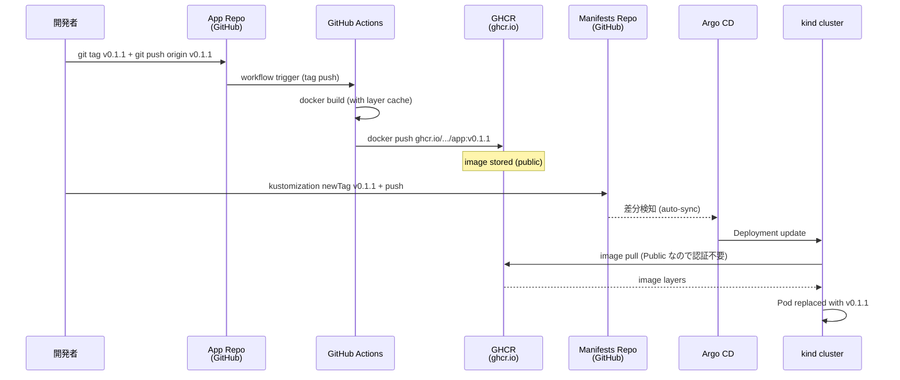

# 13 - GitHub Actions to GHCR (CI/CD パイプライン)

## 学習目標

- local `docker build + kind load` から **CI/CD ベースの image 配布** への進化を理解する
- **GitHub Actions** で git tag push をトリガに **GHCR** (GitHub Container Registry) への自動 push を実装する
- manifests を GHCR の image 参照に切り替え、Argo CD が GHCR から pull するフローを構築する

## 前提

- [06 app-of-apps](06-app-of-apps.md) が完了している (3 環境が稼働中)
- GitHub アカウント (Free プランで OK、GHCR は無料で使える)
- GHCR への書き込み権限 (= 自分のリポジトリなら最初からある)

## 背景: なぜ CI/CD が必要か

### Local build の限界 (04 章までのフロー)

```
個人 PC → docker build → kind load → kustomize edit → push manifests → Argo CD sync
```

- **個人 PC 依存**: 別マシンで再現不可、Docker のバージョン差で結果が変わる
- **共有困難**: チームで image を共有するには全員が build しないといけない
- **kind に閉じる**: 別の Kubernetes クラスタ (本番) に同じ image を配れない
- **追跡不能**: 誰が何時にどんなコードを build したかが残らない

### CI/CD の利点

```
git tag push → CI が自動 build → GHCR に push → manifests bump → Argo CD sync
```

| 観点 | Local build | CI/CD + GHCR |
|------|------------|--------------|
| 再現性 | 低い (PC 環境依存) | 高い (GitHub-hosted runner で固定) |
| 共有 | 全員 build 必要 | GHCR から pull するだけ |
| 監査 | git log のみ | Actions ログ + image SHA + GHCR タグ |
| 本番展開 | 不可 | 同じ image を本番にも配れる |
| 署名/SBOM | 個別作業 | workflow に組み込み可 |

## アーキテクチャ



## 冪等性 (再実行する場合のリセット)

```bash
# workflow を消して再作成する場合
rm ~/your-workspace/argocd-handson-demo-app/.github/workflows/release.yml

# GHCR の package を削除する場合 (GitHub UI)
# Profile → Packages → argocd-handson-demo-app → Settings → Delete package

# 既存 tag を削除する場合
git tag -d v0.1.1
git push --delete origin v0.1.1
```

---

## Step 13-① workflow ファイル作成

`argocd-handson-demo-app/.github/workflows/release.yml` を新規作成:

```yaml
name: Build and Push to GHCR

on:
  push:
    tags:
      - 'v*.*.*'
  workflow_dispatch:

env:
  REGISTRY: ghcr.io
  IMAGE_NAME: ${{ github.repository }}

jobs:
  build-and-push:
    runs-on: ubuntu-latest
    permissions:
      contents: read
      packages: write

    steps:
      - name: Checkout
        uses: actions/checkout@v4

      - name: Set up Docker Buildx
        uses: docker/setup-buildx-action@v3

      - name: Log in to GHCR
        uses: docker/login-action@v3
        with:
          registry: ${{ env.REGISTRY }}
          username: ${{ github.actor }}
          password: ${{ secrets.GITHUB_TOKEN }}

      - name: Extract metadata for Docker
        id: meta
        uses: docker/metadata-action@v5
        with:
          images: ${{ env.REGISTRY }}/${{ env.IMAGE_NAME }}
          tags: |
            type=semver,pattern={{version}}
            type=semver,pattern={{major}}.{{minor}}
            type=sha,prefix=sha-,format=short

      - name: Build and push
        uses: docker/build-push-action@v6
        with:
          context: .
          push: true
          tags: ${{ steps.meta.outputs.tags }}
          labels: ${{ steps.meta.outputs.labels }}
          cache-from: type=gha
          cache-to: type=gha,mode=max
          provenance: false
```

### 主要 step の解説

| step | 役割 |
|------|------|
| `actions/checkout` | リポジトリのコードを runner に取得 |
| `docker/setup-buildx-action` | Docker Buildx (advanced builder) を有効化、cache 機能利用のため |
| `docker/login-action` | GHCR にログイン (`GITHUB_TOKEN` で自動認証) |
| `docker/metadata-action` | git tag から image tag (semver / sha) を生成 |
| `docker/build-push-action` | build + push を一発で実行 |

### `permissions: packages: write` の意味

GitHub Actions のデフォルト `GITHUB_TOKEN` には GHCR への書き込み権限がない。これを明示的に許可する必要がある ([GITHUB_TOKEN 公式](https://docs.github.com/en/actions/security-guides/automatic-token-authentication))。

### `metadata-action` で生成される tag 例

git tag `v0.1.1` を push した場合、以下の image tag が同時に生成される:

| tag | 用途 |
|-----|------|
| `0.1.1` | semver の version 部分 (immutable) — **v プレフィックスは剥がされる** |
| `0.1` | semver の major.minor (新 patch リリースで上書きされる、mutable な参照用) |
| `sha-449898d` | コミットハッシュ短縮版 (デバッグ用) |
| `latest` | 最新 push (デフォルトで自動付与) |

⚠️ **重要**: git tag が `v0.1.1` でも、image tag は `0.1.1` (v なし)。これは Docker コミュニティの semver 慣例 ([metadata-action 仕様](https://github.com/docker/metadata-action#typesemver))。`v` を保持したい場合は `pattern=v{{version}}` と指定する。

manifests からは通常 `0.1.1` (immutable) を参照する。

---

## Step 13-② commit + push (workflow を main に入れる)

```bash
cd ~/your-workspace/argocd-handson-demo-app

git add .github/workflows/release.yml
git commit -m "Add GitHub Actions workflow for GHCR"
git push origin main
```

**この時点では workflow は走らない** (tag push がトリガなので)。

---

## Step 13-③ tag を切って CI を起動

```bash
git tag -a v0.1.1 -m "First GHCR release via CI"
git push origin v0.1.1
```

GitHub の **Actions タブ** を開くと workflow が走り始める (1〜3 分で完了)。

成功すると:
- **Actions タブ**: 緑のチェック、build と push のログが見える
- **Packages タブ**: `argocd-handson-demo-app` という package が新しく現れる
  - URL: `https://github.com/users/<USERNAME>/packages/container/package/argocd-handson-demo-app`

---

## Step 13-④ GHCR package を Public に変更

初回 push された GHCR package は **デフォルト Private**。kind が認証なしで pull するために Public 化する:

1. GitHub の Profile → **Packages**
2. `argocd-handson-demo-app` をクリック
3. 右側の **Package settings**
4. ページ下部の **Danger Zone** → **Change visibility**
5. **Public** を選択 → 確認入力 → **I understand the consequences, change package visibility**

これで `https://ghcr.io/<USERNAME>/argocd-handson-demo-app:v0.1.1` が誰でも pull できるようになる。

> **本番運用では Private のままにし、Pod に imagePullSecret を設定** するのが一般的 (本章末尾の発展セクションで紹介)。

---

## Step 13-⑤ manifests を GHCR 参照に書き換え

`argocd-handson-demo-manifests/base/kustomization.yaml`:

```yaml
apiVersion: kustomize.config.k8s.io/v1beta1
kind: Kustomization

resources:
  - deployment.yaml
  - service.yaml

images:
  - name: argocd-handson-demo-app                              # deployment.yaml の image 名
    newName: ghcr.io/<USERNAME>/argocd-handson-demo-app        # GHCR の完全修飾名に置換
    newTag: "0.1.1"                                            # ← v プレフィックスなし (上記 metadata-action 仕様)
```

**重要 2 点**:
1. `<USERNAME>` は GHCR では **小文字に正規化される**。GitHub username が `Higashi-Kota` でも `higashi-kota` と書く。
2. `newTag: "0.1.1"` は **v プレフィックスを付けない**。git tag は `v0.1.1` だが image tag は `0.1.1` になる ([metadata-action の semver type](https://github.com/docker/metadata-action#typesemver) が `v` を剥がす)。文字列であることを明示するため `"..."` で囲む。

`base/deployment.yaml` は変更不要 (image: の値は kustomize が上書きする)。

検証:
```bash
cd ~/your-workspace/argocd-handson-demo-manifests
kubectl kustomize overlays/dev | grep "image:"
# image: ghcr.io/<USERNAME>/argocd-handson-demo-app:v0.1.1
```

`ghcr.io/...` で始まる完全修飾名になっていれば OK。

---

## Step 13-⑥ commit + push (manifests)

```bash
git add base/kustomization.yaml
git commit -m "Migrate to GHCR-hosted image v0.1.1"
git push origin main
```

Argo CD が auto-sync を起動 → 全 3 環境 (dev/staging/prod) の Pod が **GHCR から image pull** → 再起動。

---

## Step 13-⑦ 動作確認

```bash
# 各 Application が新しい revision に sync 済みか
argocd app get hello-dev | grep -E "Sync Status|Health Status"

# Pod の image が ghcr.io/... になっているか
kubectl get pods -A | grep hello-server
kubectl describe pod -n hello-dev -l app=hello-server | grep "Image:"
# Image: ghcr.io/<USERNAME>/argocd-handson-demo-app:v0.1.1

# kind ノード内に GHCR pull 済み image が存在するか
docker exec argocd-handson-control-plane crictl images | grep ghcr
```

curl で各環境のレスポンス確認 (port-forward 必要):
```bash
curl http://localhost:8082/  # dev
curl http://localhost:8083/  # staging
curl http://localhost:8084/  # prod
```

---

## 検証

- GitHub Actions の workflow run が green
- GHCR の Packages タブに `argocd-handson-demo-app:v0.1.1` が存在
- Package が Public に設定済み
- `kubectl describe pod` で `Image: ghcr.io/...` 表示
- kind ノード内に GHCR の image が pull 済み (`crictl images`)
- 全環境の curl レスポンスが正常

---

## 次回以降のリリース手順

CI/CD 構築済みなので、以後は:

```bash
# 1. アプリ側で変更 + commit + push (main)
cd ~/your-workspace/argocd-handson-demo-app
# ... HelloController.java 等を編集 ...
git commit -am "Add new feature"
git push origin main

# 2. 新 tag を切って push (これだけで CI が走り、image が GHCR に上がる)
git tag -a v0.1.2 -m "Release v0.1.2"
git push origin v0.1.2

# 3. GHA が完了したら manifests の newTag を bump
cd ~/your-workspace/argocd-handson-demo-manifests
sed -i 's/newTag: v0.1.1/newTag: v0.1.2/' base/kustomization.yaml
git commit -am "Bump to v0.1.2"
git push origin main

# 4. Argo CD が auto-sync で各 Pod を v0.1.2 に更新
```

3 ステップに集約され、全工程に **kubectl も docker も使わない**。これが GitOps + CI/CD の到達点。

---

## 発展 1: Private GHCR + imagePullSecret (本番運用向け)

GHCR を Private のままにする場合、kind が pull するための認証情報を K8s Secret として注入する:

### 1) Personal Access Token (PAT) 発行
- GitHub → Settings → Developer settings → Personal access tokens (classic)
- スコープ: **`read:packages`** のみ (最小権限)
- 発行された PAT 値を控える

### 2) K8s Secret 作成
```bash
# 各 namespace に同じ secret を作成 (3 環境分)
for ns in hello-dev hello-staging hello-prod; do
  kubectl create secret docker-registry ghcr-pull \
    --namespace=$ns \
    --docker-server=ghcr.io \
    --docker-username=<USERNAME> \
    --docker-password=<PAT> \
    --docker-email=<your-email>
done
```

### 3) Deployment に `imagePullSecrets:` 追加
`base/deployment.yaml` の `spec.template.spec` 直下に:
```yaml
imagePullSecrets:
  - name: ghcr-pull
```

これで Private GHCR の image を Pod が pull できる。

**さらに進化**: `External Secrets Operator` で Vault / AWS Secrets Manager から PAT を同期、もしくは GitHub の short-lived token を使う仕組みも可能。

---

## 発展 2: argocd-image-updater で manifests も自動 bump

現状: 「新 tag が GHCR に上がっても、人が `kustomization.yaml` を編集 → commit する」工程が残っている。

**argocd-image-updater** ([argocd-image-updater 公式](https://argocd-image-updater.readthedocs.io/)) を導入すると:
- 定期的に GHCR を polling して新 tag を検知
- 自動的に manifests リポジトリに commit (PR or 直接 push)
- = アプリ tag push → 全 Pod 反映まで完全自動

### インストール
```bash
kubectl apply -n argocd \
  -f https://raw.githubusercontent.com/argoproj-labs/argocd-image-updater/stable/manifests/install.yaml
```

### Application annotation 設定
```yaml
metadata:
  annotations:
    argocd-image-updater.argoproj.io/image-list: app=ghcr.io/<USERNAME>/argocd-handson-demo-app
    argocd-image-updater.argoproj.io/app.update-strategy: semver
    argocd-image-updater.argoproj.io/write-back-method: git
```

`update-strategy: semver` で「最新の semver tag に追従」を意味する。Application 単位で適用範囲を指定可能。

### 完全自動化後のフロー
```
git tag push → CI build → GHCR push → image-updater 検知 → manifests 自動 commit → Argo CD sync
```

人手は最初の `git tag` だけになる。

---

## 発展 3: SBOM / Cosign 署名 (Supply Chain Security)

Supply chain attack を防ぐため、image に **署名** と **SBOM** を付ける:

### Cosign 署名
```yaml
# workflow に追加
- name: Install Cosign
  uses: sigstore/cosign-installer@v3

- name: Sign image with Cosign
  env:
    COSIGN_EXPERIMENTAL: 1
  run: |
    cosign sign --yes ${{ env.REGISTRY }}/${{ env.IMAGE_NAME }}@${{ steps.build.outputs.digest }}
```

GitHub OIDC により keyless (鍵管理不要) 署名が可能。

### SBOM 生成
```yaml
- name: Generate SBOM
  uses: anchore/sbom-action@v0
  with:
    image: ${{ env.REGISTRY }}/${{ env.IMAGE_NAME }}:latest
    format: spdx-json
```

Argo CD は将来的に署名検証を組み込む予定 (Sigstore policy controller との統合)。

---

## 落とし穴 (トラブルシューティング)

| 症状 | 原因 | 対処 |
|------|------|------|
| workflow が走らない | tag 形式不一致 | `v*.*.*` パターン (例: `v0.1.1`) で push しているか |
| GHCR push で 403 Forbidden | `permissions.packages: write` 漏れ | workflow の `permissions:` ブロック確認 |
| kind から GHCR pull 失敗 (`ImagePullBackOff`) | package が Private | GitHub UI で Public 化、もしくは imagePullSecret 設定 |
| `manifest unknown` エラー | tag 名 mismatch | `kustomization.yaml` の `newTag` と GHCR にある tag が一致しているか確認 (例: git tag `v0.1.1` → image tag `0.1.1`、v 剥がし) |
| image 名の username が大文字 | URL は小文字必須 | `Higashi-Kota` → `higashi-kota` (GHCR が自動小文字化) |
| build cache が効かない (毎回 5 分) | GHA cache 設定漏れ | `cache-from: type=gha` `cache-to: type=gha,mode=max` 確認 |
| `provenance: true` で kind が pull 失敗 | OCI attestation manifest を kind が解釈できない | workflow の `provenance: false` を確認 |

---

## 一次情報

- [GitHub Actions](https://docs.github.com/en/actions) - 公式ドキュメント
- [GitHub Container Registry (GHCR)](https://docs.github.com/en/packages/working-with-a-github-packages-registry/working-with-the-container-registry) - GHCR 公式
- [GITHUB_TOKEN automatic authentication](https://docs.github.com/en/actions/security-guides/automatic-token-authentication) - permissions の仕組み
- [docker/build-push-action](https://github.com/docker/build-push-action) - build + push action
- [docker/metadata-action](https://github.com/docker/metadata-action) - tag 生成
- [docker/login-action](https://github.com/docker/login-action) - registry 認証
- [Configuring a package's visibility](https://docs.github.com/en/packages/learn-github-packages/configuring-a-packages-access-control-and-visibility) - public/private 切替
- [Pull an image from a private registry (Kubernetes)](https://kubernetes.io/docs/tasks/configure-pod-container/pull-image-private-registry/) - imagePullSecret 仕様
- [argocd-image-updater](https://argocd-image-updater.readthedocs.io/) - 完全自動 bump (発展 2)
- [Sigstore Cosign](https://docs.sigstore.dev/cosign/overview/) - image 署名 (発展 3)

---

[← 前へ 12 Blue/Green Deployment](12-blue-green-deployment.md) | [↑ ハンズオン全章 (README)](../README.md)
