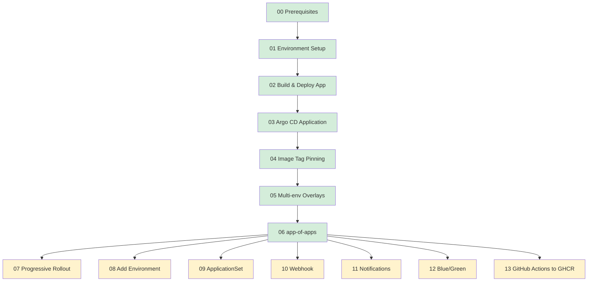

# Documentation Index

このディレクトリは Argo CD ハンズオンの全章をまとめたドキュメントハブです。トップの [README.md](../README.md) も参照してください。

## 章間依存関係

## 推奨学習ペース

### 1 日完走 (5〜6 時間)
00 → 06 を 1 日で通す。集中ブロックを 2〜3 回に分ける。

| 区切り | 範囲 | 時間 |
|-------|------|------|
| Block 1 (午前) | 00 + 01 + 02 | 約 2 時間 |
| 昼休憩 | — | — |
| Block 2 (午後) | 03 + 04 + 05 | 約 2 時間 |
| Block 3 (夕方) | 06 + 振り返り | 約 1 時間 |

### 2 日プラン (推奨)
1 日の集中力を考えて分割。

| 日 | 範囲 |
|----|------|
| Day 1 | 00 + 01 + 02 + 03 (Argo CD 初回成功体験まで) |
| Day 2 | 04 + 05 + 06 (Kustomize + マルチ環境 + app-of-apps) |
| (Optional Day 3) | 発展課題 + Blue/Green |

### 3 日以上 (じっくり)
平日夜を想定し、1 セッション 60〜90 分で 2〜3 章ずつ。

## 各章のサイズ感

| 章 | 行数目安 | 主な作業時間 |
|----|---------|-------------|
| 00-prerequisites | ~150 行 | 30 分 (ツール導入) |
| 01-environment-setup | ~200 行 | 15 分 |
| 02-build-and-deploy-app | ~400 行 | 45〜60 分 |
| 03-argocd-application | ~250 行 | 15〜20 分 |
| 04-image-tag-pinning | ~350 行 | 30〜45 分 |
| 05-multi-environment-overlays | ~400 行 | 45〜60 分 |
| 06-app-of-apps | ~250 行 | 20〜30 分 |
| 07-progressive-rollout | ~200 行 | 30 分 |
| 08-add-environment | ~200 行 | 30 分 |
| 09-applicationset | ~250 行 | 45 分 |
| 10-webhook-integration | ~300 行 | 60 分 |
| 11-notifications | ~250 行 | 45 分 |
| 12-blue-green-deployment | ~500 行 | 60〜90 分 |
| 13-github-actions-ghcr | ~400 行 | 30〜60 分 (GHCR 設定込) |

## 共通用語

| 用語 | 意味 |
|------|------|
| **kind** | Kubernetes IN Docker。ローカル PC で K8s クラスタを Docker コンテナとして動かすツール |
| **manifest** | Kubernetes リソース定義 YAML (Deployment / Service / Namespace 等) |
| **GitOps** | Git をシステム状態の Single Source of Truth として運用するパラダイム |
| **Argo CD** | Kubernetes 向け GitOps コントローラ。git ↔ クラスタの状態同期を継続的に行う |
| **Application** | Argo CD の最小管理単位。「どの repo の何を、どの cluster の何処に展開するか」を定義する CRD |
| **Kustomize** | Kubernetes manifest をテンプレ言語なしで base + overlay でカスタマイズするツール (kubectl 内蔵) |
| **app-of-apps** | Argo CD の Application 自体を別 Application で管理するパターン。階層化により運用が一切手作業を必要としなくなる |

## 一次情報リンクの確認方針

このドキュメントで参照する URL は **執筆時点 (2026 年 4 月) で有効なもののみ** を採用しています。万が一 404 になった場合は、各プロジェクトの新しいドキュメント構造に沿って読み替えてください。

## 質問・改善提案

このドキュメントは個人の学習ナレッジを再現可能形式に整理したものです。誤りや改善案があれば PR / Issue を歓迎します。
